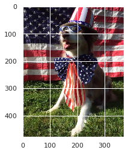
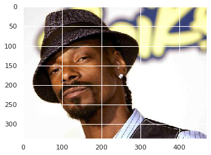
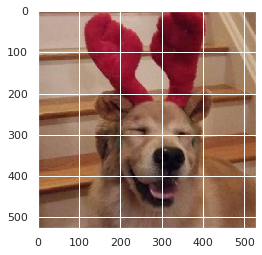
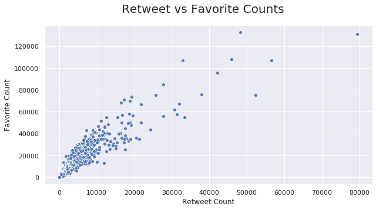
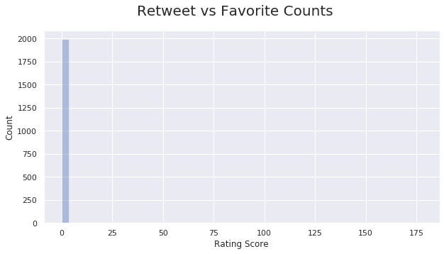
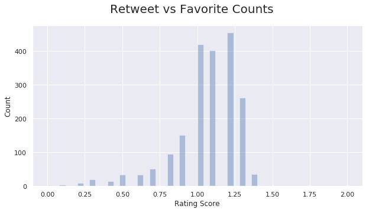

# Wrangle and Analyze Data
#### Case Study with WeRateDogs Twitter Dataset


```python
import json
import requests
from PIL import Image
from io import BytesIO
from functools import reduce

import numpy as np
import pandas as pd
pd.set_option('display.max_columns', None)
pd.options.display.max_colwidth = 280

# Plotting
import matplotlib.pyplot as plt
%matplotlib inline

import seaborn as sns
sns.set_style("whitegrid")
sns.set()
```

## Gather
Due to some issues with the Twitter developer account, I decided to take the shortcut approach instead since it is allowed. On the plus side, it saves time and allows for a cleaner notebook. And I won't be missing much since I used many other APIs in the past.


```python
t_arc_path = "twitter-archive-enhanced.csv"
t_pred_path = "image_predictions.tsv"
t_pred_url = "https://d17h27t6h515a5.cloudfront.net/topher/2017/August/599fd2ad_image-predictions/image-predictions.tsv"
t_json_path = "tweet_json.txt"
```


```python
t_arc_df = pd.read_csv(t_arc_path)
t_pred_df = pd.read_csv(t_pred_url, delimiter= '\t')
t_pred_df.to_csv(t_pred_path, sep='\t')
t_json_df = None
with open(t_json_path) as file:
    js = file.read()
    t_json_df = pd.read_json(js, lines=True)[['id','favorite_count','retweet_count']]
```

## Assess
***


```python
t_arc_df.head()
```


<div>
<style scoped>
    .dataframe tbody tr th:only-of-type {
        vertical-align: middle;
    }

    .dataframe tbody tr th {
        vertical-align: top;
    }

    .dataframe thead th {
        text-align: right;
    }
</style>
<table border="1" class="dataframe">
  <thead>
    <tr style="text-align: right;">
      <th></th>
      <th>tweet_id</th>
      <th>in_reply_to_status_id</th>
      <th>in_reply_to_user_id</th>
      <th>timestamp</th>
      <th>source</th>
      <th>text</th>
      <th>retweeted_status_id</th>
      <th>retweeted_status_user_id</th>
      <th>retweeted_status_timestamp</th>
      <th>expanded_urls</th>
      <th>rating_numerator</th>
      <th>rating_denominator</th>
      <th>name</th>
      <th>doggo</th>
      <th>floofer</th>
      <th>pupper</th>
      <th>puppo</th>
    </tr>
  </thead>
  <tbody>
    <tr>
      <th>0</th>
      <td>892420643555336193</td>
      <td>NaN</td>
      <td>NaN</td>
      <td>2017-08-01 16:23:56 +0000</td>
      <td>&lt;a href="http://twitter.com/download/iphone" rel="nofollow"&gt;Twitter for iPhone&lt;/a&gt;</td>
      <td>This is Phineas. He's a mystical boy. Only ever appears in the hole of a donut. 13/10 https://t.co/MgUWQ76dJU</td>
      <td>NaN</td>
      <td>NaN</td>
      <td>NaN</td>
      <td>https://twitter.com/dog_rates/status/892420643555336193/photo/1</td>
      <td>13</td>
      <td>10</td>
      <td>Phineas</td>
      <td>None</td>
      <td>None</td>
      <td>None</td>
      <td>None</td>
    </tr>
    <tr>
      <th>1</th>
      <td>892177421306343426</td>
      <td>NaN</td>
      <td>NaN</td>
      <td>2017-08-01 00:17:27 +0000</td>
      <td>&lt;a href="http://twitter.com/download/iphone" rel="nofollow"&gt;Twitter for iPhone&lt;/a&gt;</td>
      <td>This is Tilly. She's just checking pup on you. Hopes you're doing ok. If not, she's available for pats, snugs, boops, the whole bit. 13/10 https://t.co/0Xxu71qeIV</td>
      <td>NaN</td>
      <td>NaN</td>
      <td>NaN</td>
      <td>https://twitter.com/dog_rates/status/892177421306343426/photo/1</td>
      <td>13</td>
      <td>10</td>
      <td>Tilly</td>
      <td>None</td>
      <td>None</td>
      <td>None</td>
      <td>None</td>
    </tr>
    <tr>
      <th>2</th>
      <td>891815181378084864</td>
      <td>NaN</td>
      <td>NaN</td>
      <td>2017-07-31 00:18:03 +0000</td>
      <td>&lt;a href="http://twitter.com/download/iphone" rel="nofollow"&gt;Twitter for iPhone&lt;/a&gt;</td>
      <td>This is Archie. He is a rare Norwegian Pouncing Corgo. Lives in the tall grass. You never know when one may strike. 12/10 https://t.co/wUnZnhtVJB</td>
      <td>NaN</td>
      <td>NaN</td>
      <td>NaN</td>
      <td>https://twitter.com/dog_rates/status/891815181378084864/photo/1</td>
      <td>12</td>
      <td>10</td>
      <td>Archie</td>
      <td>None</td>
      <td>None</td>
      <td>None</td>
      <td>None</td>
    </tr>
    <tr>
      <th>3</th>
      <td>891689557279858688</td>
      <td>NaN</td>
      <td>NaN</td>
      <td>2017-07-30 15:58:51 +0000</td>
      <td>&lt;a href="http://twitter.com/download/iphone" rel="nofollow"&gt;Twitter for iPhone&lt;/a&gt;</td>
      <td>This is Darla. She commenced a snooze mid meal. 13/10 happens to the best of us https://t.co/tD36da7qLQ</td>
      <td>NaN</td>
      <td>NaN</td>
      <td>NaN</td>
      <td>https://twitter.com/dog_rates/status/891689557279858688/photo/1</td>
      <td>13</td>
      <td>10</td>
      <td>Darla</td>
      <td>None</td>
      <td>None</td>
      <td>None</td>
      <td>None</td>
    </tr>
    <tr>
      <th>4</th>
      <td>891327558926688256</td>
      <td>NaN</td>
      <td>NaN</td>
      <td>2017-07-29 16:00:24 +0000</td>
      <td>&lt;a href="http://twitter.com/download/iphone" rel="nofollow"&gt;Twitter for iPhone&lt;/a&gt;</td>
      <td>This is Franklin. He would like you to stop calling him "cute." He is a very fierce shark and should be respected as such. 12/10 #BarkWeek https://t.co/AtUZn91f7f</td>
      <td>NaN</td>
      <td>NaN</td>
      <td>NaN</td>
      <td>https://twitter.com/dog_rates/status/891327558926688256/photo/1,https://twitter.com/dog_rates/status/891327558926688256/photo/1</td>
      <td>12</td>
      <td>10</td>
      <td>Franklin</td>
      <td>None</td>
      <td>None</td>
      <td>None</td>
      <td>None</td>
    </tr>
  </tbody>
</table>
</div>


```python
t_arc_df.info()
```

    <class 'pandas.core.frame.DataFrame'>
    RangeIndex: 2356 entries, 0 to 2355
    Data columns (total 17 columns):
     #   Column                      Non-Null Count  Dtype  
    ---  ------                      --------------  -----  
     0   tweet_id                    2356 non-null   int64  
     1   in_reply_to_status_id       78 non-null     float64
     2   in_reply_to_user_id         78 non-null     float64
     3   timestamp                   2356 non-null   object 
     4   source                      2356 non-null   object 
     5   text                        2356 non-null   object 
     6   retweeted_status_id         181 non-null    float64
     7   retweeted_status_user_id    181 non-null    float64
     8   retweeted_status_timestamp  181 non-null    object 
     9   expanded_urls               2297 non-null   object 
     10  rating_numerator            2356 non-null   int64  
     11  rating_denominator          2356 non-null   int64  
     12  name                        2356 non-null   object 
     13  doggo                       2356 non-null   object 
     14  floofer                     2356 non-null   object 
     15  pupper                      2356 non-null   object 
     16  puppo                       2356 non-null   object 
    dtypes: float64(4), int64(3), object(10)
    memory usage: 313.0+ KB


```python
t_arc_df.describe()
```


<div>
<style scoped>
    .dataframe tbody tr th:only-of-type {
        vertical-align: middle;
    }

    .dataframe tbody tr th {
        vertical-align: top;
    }

    .dataframe thead th {
        text-align: right;
    }
</style>
<table border="1" class="dataframe">
  <thead>
    <tr style="text-align: right;">
      <th></th>
      <th>tweet_id</th>
      <th>in_reply_to_status_id</th>
      <th>in_reply_to_user_id</th>
      <th>retweeted_status_id</th>
      <th>retweeted_status_user_id</th>
      <th>rating_numerator</th>
      <th>rating_denominator</th>
    </tr>
  </thead>
  <tbody>
    <tr>
      <th>count</th>
      <td>2.356000e+03</td>
      <td>7.800000e+01</td>
      <td>7.800000e+01</td>
      <td>1.810000e+02</td>
      <td>1.810000e+02</td>
      <td>2356.000000</td>
      <td>2356.000000</td>
    </tr>
    <tr>
      <th>mean</th>
      <td>7.427716e+17</td>
      <td>7.455079e+17</td>
      <td>2.014171e+16</td>
      <td>7.720400e+17</td>
      <td>1.241698e+16</td>
      <td>13.126486</td>
      <td>10.455433</td>
    </tr>
    <tr>
      <th>std</th>
      <td>6.856705e+16</td>
      <td>7.582492e+16</td>
      <td>1.252797e+17</td>
      <td>6.236928e+16</td>
      <td>9.599254e+16</td>
      <td>45.876648</td>
      <td>6.745237</td>
    </tr>
    <tr>
      <th>min</th>
      <td>6.660209e+17</td>
      <td>6.658147e+17</td>
      <td>1.185634e+07</td>
      <td>6.661041e+17</td>
      <td>7.832140e+05</td>
      <td>0.000000</td>
      <td>0.000000</td>
    </tr>
    <tr>
      <th>25%</th>
      <td>6.783989e+17</td>
      <td>6.757419e+17</td>
      <td>3.086374e+08</td>
      <td>7.186315e+17</td>
      <td>4.196984e+09</td>
      <td>10.000000</td>
      <td>10.000000</td>
    </tr>
    <tr>
      <th>50%</th>
      <td>7.196279e+17</td>
      <td>7.038708e+17</td>
      <td>4.196984e+09</td>
      <td>7.804657e+17</td>
      <td>4.196984e+09</td>
      <td>11.000000</td>
      <td>10.000000</td>
    </tr>
    <tr>
      <th>75%</th>
      <td>7.993373e+17</td>
      <td>8.257804e+17</td>
      <td>4.196984e+09</td>
      <td>8.203146e+17</td>
      <td>4.196984e+09</td>
      <td>12.000000</td>
      <td>10.000000</td>
    </tr>
    <tr>
      <th>max</th>
      <td>8.924206e+17</td>
      <td>8.862664e+17</td>
      <td>8.405479e+17</td>
      <td>8.874740e+17</td>
      <td>7.874618e+17</td>
      <td>1776.000000</td>
      <td>170.000000</td>
    </tr>
  </tbody>
</table>
</div>


```python
dup = t_arc_df[t_arc_df.duplicated()]
print("Duplicate Rows: {}".format(dup.shape[0]))
```

    Duplicate Rows: 0


```python
t_arc_df.isnull().sum()
```


    tweet_id                         0
    in_reply_to_status_id         2278
    in_reply_to_user_id           2278
    timestamp                        0
    source                           0
    text                             0
    retweeted_status_id           2175
    retweeted_status_user_id      2175
    retweeted_status_timestamp    2175
    expanded_urls                   59
    rating_numerator                 0
    rating_denominator               0
    name                             0
    doggo                            0
    floofer                          0
    pupper                           0
    puppo                            0
    dtype: int64


```python
t_arc_df["name"].value_counts()
```


    None        745
    a            55
    Charlie      12
    Cooper       11
    Lucy         11
               ... 
    Wesley        1
    Skittles      1
    Ginger        1
    Jersey        1
    Maya          1
    Name: name, Length: 957, dtype: int64


```python
t_arc_df[t_arc_df['rating_denominator'] == 0]
```


<div>
<style scoped>
    .dataframe tbody tr th:only-of-type {
        vertical-align: middle;
    }

    .dataframe tbody tr th {
        vertical-align: top;
    }

    .dataframe thead th {
        text-align: right;
    }
</style>
<table border="1" class="dataframe">
  <thead>
    <tr style="text-align: right;">
      <th></th>
      <th>tweet_id</th>
      <th>in_reply_to_status_id</th>
      <th>in_reply_to_user_id</th>
      <th>timestamp</th>
      <th>source</th>
      <th>text</th>
      <th>retweeted_status_id</th>
      <th>retweeted_status_user_id</th>
      <th>retweeted_status_timestamp</th>
      <th>expanded_urls</th>
      <th>rating_numerator</th>
      <th>rating_denominator</th>
      <th>name</th>
      <th>doggo</th>
      <th>floofer</th>
      <th>pupper</th>
      <th>puppo</th>
    </tr>
  </thead>
  <tbody>
    <tr>
      <th>313</th>
      <td>835246439529840640</td>
      <td>8.352460e+17</td>
      <td>26259576.0</td>
      <td>2017-02-24 21:54:03 +0000</td>
      <td>&lt;a href="http://twitter.com/download/iphone" rel="nofollow"&gt;Twitter for iPhone&lt;/a&gt;</td>
      <td>@jonnysun @Lin_Manuel ok jomny I know you're excited but 960/00 isn't a valid rating, 13/10 is tho</td>
      <td>NaN</td>
      <td>NaN</td>
      <td>NaN</td>
      <td>NaN</td>
      <td>960</td>
      <td>0</td>
      <td>None</td>
      <td>None</td>
      <td>None</td>
      <td>None</td>
      <td>None</td>
    </tr>
  </tbody>
</table>
</div>


```python
t_arc_df[['source', 'text', 'expanded_urls']].sample(10)
```


<div>
<style scoped>
    .dataframe tbody tr th:only-of-type {
        vertical-align: middle;
    }

    .dataframe tbody tr th {
        vertical-align: top;
    }

    .dataframe thead th {
        text-align: right;
    }
</style>
<table border="1" class="dataframe">
  <thead>
    <tr style="text-align: right;">
      <th></th>
      <th>source</th>
      <th>text</th>
      <th>expanded_urls</th>
    </tr>
  </thead>
  <tbody>
    <tr>
      <th>80</th>
      <td>&lt;a href="http://twitter.com/download/iphone" rel="nofollow"&gt;Twitter for iPhone&lt;/a&gt;</td>
      <td>Meet Dante. At first he wasn't a fan of his new raincoat, then he saw his reflection. H*ckin handsome. 13/10 for water resistant good boy https://t.co/SHRTIo5pxc</td>
      <td>https://twitter.com/dog_rates/status/877316821321428993/photo/1,https://twitter.com/dog_rates/status/877316821321428993/photo/1</td>
    </tr>
    <tr>
      <th>1747</th>
      <td>&lt;a href="http://twitter.com/download/iphone" rel="nofollow"&gt;Twitter for iPhone&lt;/a&gt;</td>
      <td>This is officially the greatest yawn of all time. 12/10 https://t.co/4R0Cc0sLVE</td>
      <td>https://twitter.com/dog_rates/status/679111216690831360/video/1</td>
    </tr>
    <tr>
      <th>1623</th>
      <td>&lt;a href="http://twitter.com/download/iphone" rel="nofollow"&gt;Twitter for iPhone&lt;/a&gt;</td>
      <td>This is Perry. He's an Augustus Gloopster. Very condescending. Makes up for it with the sneaky tongue slip. 11/10 https://t.co/JVvIrUmTkR</td>
      <td>https://twitter.com/dog_rates/status/684902183876321280/photo/1</td>
    </tr>
    <tr>
      <th>1649</th>
      <td>&lt;a href="http://twitter.com/download/iphone" rel="nofollow"&gt;Twitter for iPhone&lt;/a&gt;</td>
      <td>Meet Sebastian. He's a womanizer. Romantic af. Always covered in flower petals. Also a poet. 11/10 dreamy as hell https://t.co/eoL1bCpWCg</td>
      <td>https://twitter.com/dog_rates/status/683742671509258241/photo/1</td>
    </tr>
    <tr>
      <th>987</th>
      <td>&lt;a href="http://twitter.com/download/iphone" rel="nofollow"&gt;Twitter for iPhone&lt;/a&gt;</td>
      <td>This is Dietrich. He hops at random. Other doggos don't understand him. It upsets him greatly. 8/10 would comfort https://t.co/U8cSRz8wzC</td>
      <td>https://twitter.com/dog_rates/status/749036806121881602/photo/1</td>
    </tr>
    <tr>
      <th>624</th>
      <td>&lt;a href="http://twitter.com/download/iphone" rel="nofollow"&gt;Twitter for iPhone&lt;/a&gt;</td>
      <td>Elder doggo does a splash. Both 13/10 incredible stuff https://t.co/gBUDjdEcqz</td>
      <td>https://twitter.com/dog_rates/status/795464331001561088/video/1</td>
    </tr>
    <tr>
      <th>1814</th>
      <td>&lt;a href="http://twitter.com/download/iphone" rel="nofollow"&gt;Twitter for iPhone&lt;/a&gt;</td>
      <td>I promise this wasn't meant to be a cuteness overload account but ermergerd look at this cozy pupper. 13/10 https://t.co/mpQl2rJjDh</td>
      <td>https://twitter.com/dog_rates/status/676617503762681856/photo/1</td>
    </tr>
    <tr>
      <th>2041</th>
      <td>&lt;a href="http://twitter.com/download/iphone" rel="nofollow"&gt;Twitter for iPhone&lt;/a&gt;</td>
      <td>This is JD (stands for "just dog"). He's like Airbud but with trading card games instead of sports. 10/10 much skill https://t.co/zzueJV9jCF</td>
      <td>https://twitter.com/dog_rates/status/671542985629241344/photo/1</td>
    </tr>
    <tr>
      <th>1157</th>
      <td>&lt;a href="http://twitter.com/download/iphone" rel="nofollow"&gt;Twitter for iPhone&lt;/a&gt;</td>
      <td>This is Ashleigh. She's having Coachella withdrawals. Didn't even go tho. 10/10 stay strong pupper https://t.co/nRUaKWnJfH</td>
      <td>https://twitter.com/dog_rates/status/724405726123311104/photo/1</td>
    </tr>
    <tr>
      <th>1166</th>
      <td>&lt;a href="http://twitter.com/download/iphone" rel="nofollow"&gt;Twitter for iPhone&lt;/a&gt;</td>
      <td>Meet Schnitzel. He's a Tropicana Floofboop. Getting too big for his favorite basket. 12/10 just so damn fluffy https://t.co/qjd0UJKYUY</td>
      <td>https://twitter.com/dog_rates/status/722613351520608256/photo/1</td>
    </tr>
  </tbody>
</table>
</div>


```python
rt1 = t_arc_df["retweeted_status_id"].notnull()
rt2 = t_arc_df["retweeted_status_user_id"].notnull()
rt3 = t_arc_df["text"].str.startswith("RT")

rt4 = (rt1 | rt2 | rt3)
print(rt1.sum(), rt2.sum(), rt3.sum(), rt4.sum())
```

    181 181 183 183


```python
set(t_arc_df["name"].to_list())
```


    {'Abby',
     'Ace',
     'Acro',
     'Adele',
     'Aiden',
     'Aja',
     'Akumi',
     'Al',
     'Albert',
     'Albus',
     'Aldrick',
     'Alejandro',
     'Alexander',
     'Alexanderson',
     'Alf',
     'Alfie',
     'Alfy',
     'Alice',
     'Amber',
     'Ambrose',
     'Amy',
     'Amélie',
     'Anakin',
     'Andru',
     'Andy',
     'Angel',
     'Anna',
     'Anthony',
     'Antony',
     'Apollo',
     'Aqua',
     'Archie',
     'Arlen',
     'Arlo',
     'Arnie',
     'Arnold',
     'Arya',
     'Ash',
     'Asher',
     'Ashleigh',
     'Aspen',
     'Astrid',
     'Atlas',
     'Atticus',
     'Aubie',
     'Augie',
     'Autumn',
     'Ava',
     'Axel',
     'Bailey',
     'Baloo',
     'Balto',
     'Banditt',
     'Banjo',
     'Barclay',
     'Barney',
     'Baron',
     'Barry',
     'Batdog',
     'Bauer',
     'Baxter',
     'Bayley',
     'BeBe',
     'Bear',
     'Beau',
     'Beckham',
     'Beebop',
     'Beemo',
     'Bell',
     'Bella',
     'Belle',
     'Ben',
     'Benedict',
     'Benji',
     'Benny',
     'Bentley',
     'Berb',
     'Berkeley',
     'Bernie',
     'Bert',
     'Bertson',
     'Betty',
     'Beya',
     'Biden',
     'Bilbo',
     'Billl',
     'Billy',
     'Binky',
     'Birf',
     'Bisquick',
     'Blakely',
     'Blanket',
     'Blipson',
     'Blitz',
     'Bloo',
     'Bloop',
     'Blu',
     'Blue',
     'Bluebert',
     'Bo',
     'Bob',
     'Bobb',
     'Bobbay',
     'Bobble',
     'Bobby',
     'Bode',
     'Bodie',
     'Bonaparte',
     'Bones',
     'Bookstore',
     'Boomer',
     'Boots',
     'Boston',
     'Bowie',
     'Brad',
     'Bradlay',
     'Bradley',
     'Brady',
     'Brandi',
     'Brandonald',
     'Brandy',
     'Brat',
     'Brian',
     'Brockly',
     'Brody',
     'Bronte',
     'Brooks',
     'Brownie',
     'Bruce',
     'Brudge',
     'Bruiser',
     'Bruno',
     'Brutus',
     'Bubba',
     'Bubbles',
     'Buckley',
     'Buddah',
     'Buddy',
     'Bungalo',
     'Burt',
     'Butter',
     'Butters',
     'Cal',
     'Calbert',
     'Cali',
     'Callie',
     'Calvin',
     'Canela',
     'Cannon',
     'Carbon',
     'Carl',
     'Carll',
     'Carly',
     'Carper',
     'Carter',
     'Caryl',
     'Cash',
     'Cassie',
     'CeCe',
     'Cecil',
     'Cedrick',
     'Cermet',
     'Chadrick',
     'Champ',
     'Charl',
     'Charles',
     'Charleson',
     'Charlie',
     'Chase',
     'Chaz',
     'Cheesy',
     'Chef',
     'Chelsea',
     'Cheryl',
     'Chesney',
     'Chester',
     'Chesterson',
     'Chet',
     'Chevy',
     'Chip',
     'Chipson',
     'Chloe',
     'Chompsky',
     'Christoper',
     'Chubbs',
     'Chuck',
     'Chuckles',
     'Chuq',
     'Churlie',
     'Cilantro',
     'Clarence',
     'Clark',
     'Clarkus',
     'Clarq',
     'Claude',
     'Cleopatricia',
     'Clifford',
     'Clybe',
     'Clyde',
     'Coco',
     'Cody',
     'Colby',
     'Coleman',
     'Colin',
     'Combo',
     'Comet',
     'Cooper',
     'Coops',
     'Coopson',
     'Cora',
     'Corey',
     'Covach',
     'Craig',
     'Crawford',
     'Creg',
     'Crimson',
     'Crouton',
     'Crumpet',
     'Crystal',
     'Cuddles',
     'Cupcake',
     'Cupid',
     'Curtis',
     'Daisy',
     'Dakota',
     'Dale',
     'Dallas',
     'Damon',
     'Daniel',
     'Danny',
     'Dante',
     'Darby',
     'Darla',
     'Darrel',
     'Dash',
     'Dave',
     'Davey',
     'Dawn',
     'DayZ',
     'Deacon',
     'Derby',
     'Derek',
     'Devón',
     'Dewey',
     'Dex',
     'Dexter',
     'Dido',
     'Dietrich',
     'Diogi',
     'Divine',
     'Dixie',
     'Django',
     'Dobby',
     'Doc',
     'DonDon',
     'Donny',
     'Doobert',
     'Dook',
     'Dot',
     'Dotsy',
     'Doug',
     'Duchess',
     'Duddles',
     'Dudley',
     'Dug',
     'Duke',
     'Dunkin',
     'Durg',
     'Dutch',
     'Dwight',
     'Dylan',
     'Earl',
     'Eazy',
     'Ebby',
     'Ed',
     'Edd',
     'Edgar',
     'Edmund',
     'Eevee',
     'Einstein',
     'Eleanor',
     'Eli',
     'Ellie',
     'Elliot',
     'Emanuel',
     'Ember',
     'Emma',
     'Emmie',
     'Emmy',
     'Enchilada',
     'Erik',
     'Eriq',
     'Ester',
     'Eugene',
     'Eve',
     'Evy',
     'Fabio',
     'Farfle',
     'Ferg',
     'Fido',
     'Fiji',
     'Fillup',
     'Filup',
     'Finley',
     'Finn',
     'Finnegus',
     'Fiona',
     'Fizz',
     'Flash',
     'Fletcher',
     'Florence',
     'Flurpson',
     'Flávio',
     'Frank',
     'Frankie',
     'Franklin',
     'Franq',
     'Fred',
     'Freddery',
     'Frönq',
     'Furzey',
     'Fwed',
     'Fynn',
     'Gabby',
     'Gabe',
     'Gary',
     'General',
     'Genevieve',
     'Geno',
     'Geoff',
     'George',
     'Georgie',
     'Gerald',
     'Gerbald',
     'Gert',
     'Gidget',
     'Gilbert',
     'Gin',
     'Ginger',
     'Gizmo',
     'Glacier',
     'Glenn',
     'Godi',
     'Godzilla',
     'Goliath',
     'Goose',
     'Gordon',
     'Grady',
     'Grey',
     'Griffin',
     'Griswold',
     'Grizz',
     'Grizzie',
     'Grizzwald',
     'Gromit',
     'Gunner',
     'Gus',
     'Gustaf',
     'Gustav',
     'Gòrdón',
     'Hall',
     'Halo',
     'Hammond',
     'Hamrick',
     'Hank',
     'Hanz',
     'Happy',
     'Harlso',
     'Harnold',
     'Harold',
     'Harper',
     'Harrison',
     'Harry',
     'Harvey',
     'Hazel',
     'Hector',
     'Heinrich',
     'Henry',
     'Herald',
     'Herb',
     'Hercules',
     'Herm',
     'Hermione',
     'Hero',
     'Herschel',
     'Hobbes',
     'Holly',
     'Horace',
     'Howie',
     'Hubertson',
     'Huck',
     'Humphrey',
     'Hunter',
     'Hurley',
     'Huxley',
     'Iggy',
     'Ike',
     'Indie',
     'Iroh',
     'Ito',
     'Ivar',
     'Izzy',
     'JD',
     'Jack',
     'Jackie',
     'Jackson',
     'Jameson',
     'Jamesy',
     'Jangle',
     'Jareld',
     'Jarod',
     'Jarvis',
     'Jaspers',
     'Jax',
     'Jay',
     'Jaycob',
     'Jazz',
     'Jazzy',
     'Jeb',
     'Jebberson',
     'Jed',
     'Jeffrey',
     'Jeffri',
     'Jeffrie',
     'Jennifur',
     'Jeph',
     'Jeremy',
     'Jerome',
     'Jerry',
     'Jersey',
     'Jesse',
     'Jessifer',
     'Jessiga',
     'Jett',
     'Jim',
     'Jimbo',
     'Jiminus',
     'Jiminy',
     'Jimison',
     'Jimothy',
     'Jo',
     'Jockson',
     'Joey',
     'Jomathan',
     'Jonah',
     'Jordy',
     'Josep',
     'Joshwa',
     'Juckson',
     'Julio',
     'Julius',
     'Juno',
     'Kaia',
     'Kaiya',
     'Kallie',
     'Kane',
     'Kanu',
     'Kara',
     'Karl',
     'Karll',
     'Karma',
     'Kathmandu',
     'Katie',
     'Kawhi',
     'Kayla',
     'Keet',
     'Keith',
     'Kellogg',
     'Ken',
     'Kendall',
     'Kenneth',
     'Kenny',
     'Kenzie',
     'Keurig',
     'Kevin',
     'Kevon',
     'Kial',
     'Kilo',
     'Kingsley',
     'Kirby',
     'Kirk',
     'Klein',
     'Klevin',
     'Kloey',
     'Kobe',
     'Koda',
     'Kody',
     'Koko',
     'Kollin',
     'Kona',
     'Kota',
     'Kramer',
     'Kreg',
     'Kreggory',
     'Kulet',
     'Kuyu',
     'Kyle',
     'Kyro',
     'Lacy',
     'Laela',
     'Laika',
     'Lambeau',
     'Lance',
     'Larry',
     'Lassie',
     'Layla',
     'Leela',
     'Lennon',
     'Lenny',
     'Lenox',
     'Leo',
     'Leonard',
     'Leonidas',
     'Levi',
     'Liam',
     'Lilah',
     'Lili',
     'Lilli',
     'Lillie',
     'Lilly',
     'Lily',
     'Lincoln',
     'Linda',
     'Link',
     'Linus',
     'Lipton',
     'Livvie',
     'Lizzie',
     'Logan',
     'Loki',
     'Lola',
     'Lolo',
     'Longfellow',
     'Loomis',
     'Lorelei',
     'Lorenzo',
     'Lou',
     'Louie',
     'Louis',
     'Luca',
     'Lucia',
     'Lucky',
     'Lucy',
     'Lugan',
     'Lulu',
     'Luna',
     'Lupe',
     'Luther',
     'Mabel',
     'Mac',
     'Mack',
     'Maddie',
     'Maggie',
     'Mairi',
     'Maisey',
     'Major',
     'Maks',
     'Malcolm',
     'Malikai',
     'Margo',
     'Mark',
     'Marlee',
     'Marley',
     'Marq',
     'Marty',
     'Marvin',
     'Mary',
     'Mason',
     'Mattie',
     'Maude',
     'Mauve',
     'Max',
     'Maxaroni',
     'Maximus',
     'Maxwell',
     'Maya',
     'Meatball',
     'Meera',
     'Meyer',
     'Mia',
     'Michelangelope',
     'Miguel',
     'Mike',
     'Miley',
     'Milky',
     'Millie',
     'Milo',
     'Mimosa',
     'Mingus',
     'Mister',
     'Misty',
     'Mitch',
     'Mo',
     'Moe',
     'Mojo',
     'Mollie',
     'Molly',
     'Mona',
     'Monkey',
     'Monster',
     'Monty',
     'Moofasa',
     'Mookie',
     'Moose',
     'Moreton',
     'Mosby',
     'Murphy',
     'Mutt',
     'Mya',
     'Nala',
     'Naphaniel',
     'Napolean',
     'Nelly',
     'Neptune',
     'Newt',
     'Nico',
     'Nida',
     'Nigel',
     'Nimbus',
     'Noah',
     'Nollie',
     'None',
     'Noosh',
     'Norman',
     'Nugget',
     'O',
     'Oakley',
     'Obi',
     'Obie',
     'Oddie',
     'Odie',
     'Odin',
     'Olaf',
     'Ole',
     'Olive',
     'Oliver',
     'Olivia',
     'Oliviér',
     'Ollie',
     'Opal',
     'Opie',
     'Oreo',
     'Orion',
     'Oscar',
     'Oshie',
     'Otis',
     'Ozzie',
     'Ozzy',
     'Pablo',
     'Paisley',
     'Pancake',
     'Panda',
     'Patch',
     'Patrick',
     'Paull',
     'Pavlov',
     'Pawnd',
     'Peaches',
     'Peanut',
     'Penelope',
     'Penny',
     'Pepper',
     'Percy',
     'Perry',
     'Pete',
     'Petrick',
     'Pherb',
     'Phil',
     'Philbert',
     'Philippe',
     'Phineas',
     'Phred',
     'Pickles',
     'Pilot',
     'Pinot',
     'Pip',
     'Piper',
     'Pippa',
     'Pippin',
     'Pipsy',
     'Pluto',
     'Poppy',
     'Pubert',
     'Puff',
     'Pumpkin',
     'Pupcasso',
     'Quinn',
     'Ralf',
     'Ralph',
     'Ralpher',
     'Ralphie',
     'Ralphson',
     'Ralphus',
     'Ralphy',
     'Ralphé',
     'Rambo',
     'Randall',
     'Raphael',
     'Rascal',
     'Raymond',
     'Reagan',
     'Reese',
     'Reggie',
     'Reginald',
     'Remington',
     'Remus',
     'Remy',
     'Reptar',
     'Rey',
     'Rhino',
     'Richie',
     'Ricky',
     'Ridley',
     'Riley',
     'Rilo',
     'Rinna',
     'River',
     'Rizzo',
     'Rizzy',
     'Robin',
     'Rocco',
     'Rocky',
     'Rodman',
     'Rodney',
     'Rolf',
     'Romeo',
     'Ron',
     'Ronduh',
     'Ronnie',
     'Rontu',
     'Rooney',
     'Roosevelt',
     'Rorie',
     'Rory',
     'Roscoe',
     'Rose',
     'Rosie',
     'Rover',
     'Rubio',
     'Ruby',
     'Rudy',
     'Rueben',
     'Ruffles',
     'Rufio',
     'Rufus',
     'Rumble',
     'Rumpole',
     'Rupert',
     'Rusty',
     'Sadie',
     'Sage',
     'Sailer',
     'Sailor',
     'Sam',
     'Sammy',
     'Sampson',
     'Samsom',
     'Samson',
     'Sandra',
     'Sandy',
     'Sansa',
     'Sarge',
     'Saydee',
     'Schnitzel',
     'Schnozz',
     'Scooter',
     'Scott',
     'Scout',
     'Scruffers',
     'Seamus',
     'Sebastian',
     'Sephie',
     'Severus',
     'Shadoe',
     'Shadow',
     'Shaggy',
     'Shakespeare',
     'Shawwn',
     'Shelby',
     'Shikha',
     'Shiloh',
     'Shnuggles',
     'Shooter',
     'Siba',
     'Sid',
     'Sierra',
     'Simba',
     'Skittle',
     'Skittles',
     'Sky',
     'Skye',
     'Smiley',
     'Smokey',
     'Snickers',
     'Snicku',
     'Snoop',
     'Snoopy',
     'Sobe',
     'Socks',
     'Sojourner',
     'Solomon',
     'Sonny',
     'Sophie',
     'Sora',
     'Spanky',
     'Spark',
     'Sparky',
     'Spencer',
     'Sprinkles',
     'Sprout',
     'Staniel',
     'Stanley',
     'Stark',
     'Stefan',
     'Stella',
     'Stephan',
     'Stephanus',
     'Steve',
     'Steven',
     'Stewie',
     'Storkson',
     'Stormy',
     'Strider',
     'Striker',
     'Strudel',
     'Stu',
     'Stuart',
     'Stubert',
     'Sugar',
     'Suki',
     'Sully',
     'Sundance',
     'Sunny',
     'Sunshine',
     'Superpup',
     'Swagger',
     'Sweet',
     'Sweets',
     'Taco',
     'Tango',
     'Tanner',
     'Tassy',
     'Tater',
     'Tayzie',
     'Taz',
     'Tebow',
     'Ted',
     'Tedders',
     'Teddy',
     'Tedrick',
     'Terrance',
     'Terrenth',
     'Terry',
     'Tess',
     'Tessa',
     'Theo',
     'Theodore',
     'Thor',
     'Thumas',
     'Tiger',
     'Tilly',
     'Timber',
     'Timison',
     'Timmy',
     'Timofy',
     'Tino',
     'Titan',
     'Tito',
     'Tobi',
     'Toby',
     'Todo',
     'Toffee',
     'Tom',
     'Tommy',
     'Tonks',
     'Torque',
     'Tove',
     'Travis',
     'Traviss',
     'Trevith',
     'Trigger',
     'Trip',
     'Tripp',
     'Trooper',
     'Tuck',
     'Tucker',
     'Tuco',
     'Tug',
     'Tupawc',
     'Tycho',
     'Tyr',
     'Tyrone',
     'Tyrus',
     'Ulysses',
     'Venti',
     'Vince',
     'Vincent',
     'Vinnie',
     'Vinscent',
     'Vixen',
     'Wafer',
     'Waffles',
     'Walker',
     'Wallace',
     'Wally',
     'Walter',
     'Watson',
     'Wesley',
     'Wiggles',
     'Willem',
     'William',
     'Willie',
     'Willow',
     'Willy',
     'Wilson',
     'Winifred',
     'Winnie',
     'Winston',
     'Wishes',
     'Wyatt',
     'Yoda',
     'Yogi',
     'Yukon',
     'Zara',
     'Zeek',
     'Zeke',
     'Zeus',
     'Ziva',
     'Zoe',
     'Zoey',
     'Zooey',
     'Zuzu',
     'a',
     'actually',
     'all',
     'an',
     'by',
     'getting',
     'his',
     'incredibly',
     'infuriating',
     'just',
     'life',
     'light',
     'mad',
     'my',
     'not',
     'officially',
     'old',
     'one',
     'quite',
     'space',
     'such',
     'the',
     'this',
     'unacceptable',
     'very'}


```python
wrong_names = ['a',
 'actually',
 'all',
 'an',
 'by',
 'getting',
 'his',
 'incredibly',
 'infuriating',
 'just',
 'life',
 'light',
 'mad',
 'my',
 'not',
 'officially',
 'old',
 'one',
 'quite',
 'space',
 'such',
 'the',
 'this',
 'unacceptable',
 'very']
```

***


```python
t_pred_df.head()
```


<div>
<style scoped>
    .dataframe tbody tr th:only-of-type {
        vertical-align: middle;
    }

    .dataframe tbody tr th {
        vertical-align: top;
    }

    .dataframe thead th {
        text-align: right;
    }
</style>
<table border="1" class="dataframe">
  <thead>
    <tr style="text-align: right;">
      <th></th>
      <th>tweet_id</th>
      <th>jpg_url</th>
      <th>img_num</th>
      <th>p1</th>
      <th>p1_conf</th>
      <th>p1_dog</th>
      <th>p2</th>
      <th>p2_conf</th>
      <th>p2_dog</th>
      <th>p3</th>
      <th>p3_conf</th>
      <th>p3_dog</th>
    </tr>
  </thead>
  <tbody>
    <tr>
      <th>0</th>
      <td>666020888022790149</td>
      <td>https://pbs.twimg.com/media/CT4udn0WwAA0aMy.jpg</td>
      <td>1</td>
      <td>Welsh_springer_spaniel</td>
      <td>0.465074</td>
      <td>True</td>
      <td>collie</td>
      <td>0.156665</td>
      <td>True</td>
      <td>Shetland_sheepdog</td>
      <td>0.061428</td>
      <td>True</td>
    </tr>
    <tr>
      <th>1</th>
      <td>666029285002620928</td>
      <td>https://pbs.twimg.com/media/CT42GRgUYAA5iDo.jpg</td>
      <td>1</td>
      <td>redbone</td>
      <td>0.506826</td>
      <td>True</td>
      <td>miniature_pinscher</td>
      <td>0.074192</td>
      <td>True</td>
      <td>Rhodesian_ridgeback</td>
      <td>0.072010</td>
      <td>True</td>
    </tr>
    <tr>
      <th>2</th>
      <td>666033412701032449</td>
      <td>https://pbs.twimg.com/media/CT4521TWwAEvMyu.jpg</td>
      <td>1</td>
      <td>German_shepherd</td>
      <td>0.596461</td>
      <td>True</td>
      <td>malinois</td>
      <td>0.138584</td>
      <td>True</td>
      <td>bloodhound</td>
      <td>0.116197</td>
      <td>True</td>
    </tr>
    <tr>
      <th>3</th>
      <td>666044226329800704</td>
      <td>https://pbs.twimg.com/media/CT5Dr8HUEAA-lEu.jpg</td>
      <td>1</td>
      <td>Rhodesian_ridgeback</td>
      <td>0.408143</td>
      <td>True</td>
      <td>redbone</td>
      <td>0.360687</td>
      <td>True</td>
      <td>miniature_pinscher</td>
      <td>0.222752</td>
      <td>True</td>
    </tr>
    <tr>
      <th>4</th>
      <td>666049248165822465</td>
      <td>https://pbs.twimg.com/media/CT5IQmsXIAAKY4A.jpg</td>
      <td>1</td>
      <td>miniature_pinscher</td>
      <td>0.560311</td>
      <td>True</td>
      <td>Rottweiler</td>
      <td>0.243682</td>
      <td>True</td>
      <td>Doberman</td>
      <td>0.154629</td>
      <td>True</td>
    </tr>
  </tbody>
</table>
</div>


```python
t_pred_df.info()
```

    <class 'pandas.core.frame.DataFrame'>
    RangeIndex: 2075 entries, 0 to 2074
    Data columns (total 12 columns):
     #   Column    Non-Null Count  Dtype  
    ---  ------    --------------  -----  
     0   tweet_id  2075 non-null   int64  
     1   jpg_url   2075 non-null   object 
     2   img_num   2075 non-null   int64  
     3   p1        2075 non-null   object 
     4   p1_conf   2075 non-null   float64
     5   p1_dog    2075 non-null   bool   
     6   p2        2075 non-null   object 
     7   p2_conf   2075 non-null   float64
     8   p2_dog    2075 non-null   bool   
     9   p3        2075 non-null   object 
     10  p3_conf   2075 non-null   float64
     11  p3_dog    2075 non-null   bool   
    dtypes: bool(3), float64(3), int64(2), object(4)
    memory usage: 152.1+ KB


```python
t_pred_df.describe()
```


<div>
<style scoped>
    .dataframe tbody tr th:only-of-type {
        vertical-align: middle;
    }

    .dataframe tbody tr th {
        vertical-align: top;
    }

    .dataframe thead th {
        text-align: right;
    }
</style>
<table border="1" class="dataframe">
  <thead>
    <tr style="text-align: right;">
      <th></th>
      <th>tweet_id</th>
      <th>img_num</th>
      <th>p1_conf</th>
      <th>p2_conf</th>
      <th>p3_conf</th>
    </tr>
  </thead>
  <tbody>
    <tr>
      <th>count</th>
      <td>2.075000e+03</td>
      <td>2075.000000</td>
      <td>2075.000000</td>
      <td>2.075000e+03</td>
      <td>2.075000e+03</td>
    </tr>
    <tr>
      <th>mean</th>
      <td>7.384514e+17</td>
      <td>1.203855</td>
      <td>0.594548</td>
      <td>1.345886e-01</td>
      <td>6.032417e-02</td>
    </tr>
    <tr>
      <th>std</th>
      <td>6.785203e+16</td>
      <td>0.561875</td>
      <td>0.271174</td>
      <td>1.006657e-01</td>
      <td>5.090593e-02</td>
    </tr>
    <tr>
      <th>min</th>
      <td>6.660209e+17</td>
      <td>1.000000</td>
      <td>0.044333</td>
      <td>1.011300e-08</td>
      <td>1.740170e-10</td>
    </tr>
    <tr>
      <th>25%</th>
      <td>6.764835e+17</td>
      <td>1.000000</td>
      <td>0.364412</td>
      <td>5.388625e-02</td>
      <td>1.622240e-02</td>
    </tr>
    <tr>
      <th>50%</th>
      <td>7.119988e+17</td>
      <td>1.000000</td>
      <td>0.588230</td>
      <td>1.181810e-01</td>
      <td>4.944380e-02</td>
    </tr>
    <tr>
      <th>75%</th>
      <td>7.932034e+17</td>
      <td>1.000000</td>
      <td>0.843855</td>
      <td>1.955655e-01</td>
      <td>9.180755e-02</td>
    </tr>
    <tr>
      <th>max</th>
      <td>8.924206e+17</td>
      <td>4.000000</td>
      <td>1.000000</td>
      <td>4.880140e-01</td>
      <td>2.734190e-01</td>
    </tr>
  </tbody>
</table>
</div>


```python
dup = t_pred_df[t_pred_df.duplicated()]
print("Duplicate Rows: {}".format(dup.shape[0]))
```

    Duplicate Rows: 0


***


```python
t_json_df.head()
```


<div>
<style scoped>
    .dataframe tbody tr th:only-of-type {
        vertical-align: middle;
    }

    .dataframe tbody tr th {
        vertical-align: top;
    }

    .dataframe thead th {
        text-align: right;
    }
</style>
<table border="1" class="dataframe">
  <thead>
    <tr style="text-align: right;">
      <th></th>
      <th>id</th>
      <th>favorite_count</th>
      <th>retweet_count</th>
    </tr>
  </thead>
  <tbody>
    <tr>
      <th>0</th>
      <td>892420643555336193</td>
      <td>39467</td>
      <td>8853</td>
    </tr>
    <tr>
      <th>1</th>
      <td>892177421306343426</td>
      <td>33819</td>
      <td>6514</td>
    </tr>
    <tr>
      <th>2</th>
      <td>891815181378084864</td>
      <td>25461</td>
      <td>4328</td>
    </tr>
    <tr>
      <th>3</th>
      <td>891689557279858688</td>
      <td>42908</td>
      <td>8964</td>
    </tr>
    <tr>
      <th>4</th>
      <td>891327558926688256</td>
      <td>41048</td>
      <td>9774</td>
    </tr>
  </tbody>
</table>
</div>


```python
t_json_df.info()
```

    <class 'pandas.core.frame.DataFrame'>
    RangeIndex: 2354 entries, 0 to 2353
    Data columns (total 3 columns):
     #   Column          Non-Null Count  Dtype
    ---  ------          --------------  -----
     0   id              2354 non-null   int64
     1   favorite_count  2354 non-null   int64
     2   retweet_count   2354 non-null   int64
    dtypes: int64(3)
    memory usage: 55.3 KB


```python
t_json_df.describe()
```


<div>
<style scoped>
    .dataframe tbody tr th:only-of-type {
        vertical-align: middle;
    }

    .dataframe tbody tr th {
        vertical-align: top;
    }

    .dataframe thead th {
        text-align: right;
    }
</style>
<table border="1" class="dataframe">
  <thead>
    <tr style="text-align: right;">
      <th></th>
      <th>id</th>
      <th>favorite_count</th>
      <th>retweet_count</th>
    </tr>
  </thead>
  <tbody>
    <tr>
      <th>count</th>
      <td>2.354000e+03</td>
      <td>2354.000000</td>
      <td>2354.000000</td>
    </tr>
    <tr>
      <th>mean</th>
      <td>7.426978e+17</td>
      <td>8080.968564</td>
      <td>3164.797366</td>
    </tr>
    <tr>
      <th>std</th>
      <td>6.852812e+16</td>
      <td>11814.771334</td>
      <td>5284.770364</td>
    </tr>
    <tr>
      <th>min</th>
      <td>6.660209e+17</td>
      <td>0.000000</td>
      <td>0.000000</td>
    </tr>
    <tr>
      <th>25%</th>
      <td>6.783975e+17</td>
      <td>1415.000000</td>
      <td>624.500000</td>
    </tr>
    <tr>
      <th>50%</th>
      <td>7.194596e+17</td>
      <td>3603.500000</td>
      <td>1473.500000</td>
    </tr>
    <tr>
      <th>75%</th>
      <td>7.993058e+17</td>
      <td>10122.250000</td>
      <td>3652.000000</td>
    </tr>
    <tr>
      <th>max</th>
      <td>8.924206e+17</td>
      <td>132810.000000</td>
      <td>79515.000000</td>
    </tr>
  </tbody>
</table>
</div>


```python
dup = t_json_df[t_json_df.duplicated()]
print("Duplicate Rows: {}".format(dup.shape[0]))
```

    Duplicate Rows: 0


**Observations on quality**
* Incorrect dog names including None and a
* `timestamp` is object, should be `datetime`
* `tweet_id` is `int`, should be `str` 
* Some columns have missing data
* `id` should be renamed `tweet_id` for consistency
* many dogs aren't given a stage (dogger, pupper ...)
* unusual rating scale, making comparisons difficult
* tables don't have the same number of entries, meaning there are missing lines
* wrong rating parsings
* different number of retweets depending on how to filter for it
* only predictions with highest probability are needed
* retweets and replies included but not needed

**Observations on tidiness**
* last 4 columns can be replaced with one
* this data can be combined in 1 table instead of 3

## Clean


```python
# Make copies before any modification
arc_df = t_arc_df.copy()
pred_df = t_pred_df.copy()
json_df = t_json_df.copy()
```

**Define**: rename `id` to `tweet_id`

**Code**:


```python
json_df.rename(columns= {'id': 'tweet_id'}, inplace= True)
```

**Test**:


```python
json_df.head()
```


<div>
<style scoped>
    .dataframe tbody tr th:only-of-type {
        vertical-align: middle;
    }

    .dataframe tbody tr th {
        vertical-align: top;
    }

    .dataframe thead th {
        text-align: right;
    }
</style>
<table border="1" class="dataframe">
  <thead>
    <tr style="text-align: right;">
      <th></th>
      <th>tweet_id</th>
      <th>favorite_count</th>
      <th>retweet_count</th>
    </tr>
  </thead>
  <tbody>
    <tr>
      <th>0</th>
      <td>892420643555336193</td>
      <td>39467</td>
      <td>8853</td>
    </tr>
    <tr>
      <th>1</th>
      <td>892177421306343426</td>
      <td>33819</td>
      <td>6514</td>
    </tr>
    <tr>
      <th>2</th>
      <td>891815181378084864</td>
      <td>25461</td>
      <td>4328</td>
    </tr>
    <tr>
      <th>3</th>
      <td>891689557279858688</td>
      <td>42908</td>
      <td>8964</td>
    </tr>
    <tr>
      <th>4</th>
      <td>891327558926688256</td>
      <td>41048</td>
      <td>9774</td>
    </tr>
  </tbody>
</table>
</div>


**Define**: change `tweet_id` types to `str`

**Code**:


```python
arc_df["tweet_id"] = arc_df["tweet_id"].astype(str)
pred_df["tweet_id"] = pred_df["tweet_id"].astype(str)
json_df["tweet_id"] = json_df["tweet_id"].astype(str)
```

**Test**:


```python
arc_df.info()
pred_df.info()
json_df.info()
```

    <class 'pandas.core.frame.DataFrame'>
    RangeIndex: 2356 entries, 0 to 2355
    Data columns (total 17 columns):
     #   Column                      Non-Null Count  Dtype  
    ---  ------                      --------------  -----  
     0   tweet_id                    2356 non-null   object 
     1   in_reply_to_status_id       78 non-null     float64
     2   in_reply_to_user_id         78 non-null     float64
     3   timestamp                   2356 non-null   object 
     4   source                      2356 non-null   object 
     5   text                        2356 non-null   object 
     6   retweeted_status_id         181 non-null    float64
     7   retweeted_status_user_id    181 non-null    float64
     8   retweeted_status_timestamp  181 non-null    object 
     9   expanded_urls               2297 non-null   object 
     10  rating_numerator            2356 non-null   int64  
     11  rating_denominator          2356 non-null   int64  
     12  name                        2356 non-null   object 
     13  doggo                       2356 non-null   object 
     14  floofer                     2356 non-null   object 
     15  pupper                      2356 non-null   object 
     16  puppo                       2356 non-null   object 
    dtypes: float64(4), int64(2), object(11)
    memory usage: 313.0+ KB
    <class 'pandas.core.frame.DataFrame'>
    RangeIndex: 2075 entries, 0 to 2074
    Data columns (total 12 columns):
     #   Column    Non-Null Count  Dtype  
    ---  ------    --------------  -----  
     0   tweet_id  2075 non-null   object 
     1   jpg_url   2075 non-null   object 
     2   img_num   2075 non-null   int64  
     3   p1        2075 non-null   object 
     4   p1_conf   2075 non-null   float64
     5   p1_dog    2075 non-null   bool   
     6   p2        2075 non-null   object 
     7   p2_conf   2075 non-null   float64
     8   p2_dog    2075 non-null   bool   
     9   p3        2075 non-null   object 
     10  p3_conf   2075 non-null   float64
     11  p3_dog    2075 non-null   bool   
    dtypes: bool(3), float64(3), int64(1), object(5)
    memory usage: 152.1+ KB
    <class 'pandas.core.frame.DataFrame'>
    RangeIndex: 2354 entries, 0 to 2353
    Data columns (total 3 columns):
     #   Column          Non-Null Count  Dtype 
    ---  ------          --------------  ----- 
     0   tweet_id        2354 non-null   object
     1   favorite_count  2354 non-null   int64 
     2   retweet_count   2354 non-null   int64 
    dtypes: int64(2), object(1)
    memory usage: 55.3+ KB


**Define**: join all tables on `tweet_id`

**Code**:


```python
# https://stackoverflow.com/questions/23668427/pandas-three-way-joining-multiple-dataframes-on-columns
dfs = [arc_df, pred_df, json_df]
df_clean = reduce(lambda left,right: pd.merge(left,right, how = 'inner', on='tweet_id'), dfs)
```

**Test**:


```python
df_clean.info()
```

    <class 'pandas.core.frame.DataFrame'>
    Int64Index: 2073 entries, 0 to 2072
    Data columns (total 30 columns):
     #   Column                      Non-Null Count  Dtype  
    ---  ------                      --------------  -----  
     0   tweet_id                    2073 non-null   object 
     1   in_reply_to_status_id       23 non-null     float64
     2   in_reply_to_user_id         23 non-null     float64
     3   timestamp                   2073 non-null   object 
     4   source                      2073 non-null   object 
     5   text                        2073 non-null   object 
     6   retweeted_status_id         79 non-null     float64
     7   retweeted_status_user_id    79 non-null     float64
     8   retweeted_status_timestamp  79 non-null     object 
     9   expanded_urls               2073 non-null   object 
     10  rating_numerator            2073 non-null   int64  
     11  rating_denominator          2073 non-null   int64  
     12  name                        2073 non-null   object 
     13  doggo                       2073 non-null   object 
     14  floofer                     2073 non-null   object 
     15  pupper                      2073 non-null   object 
     16  puppo                       2073 non-null   object 
     17  jpg_url                     2073 non-null   object 
     18  img_num                     2073 non-null   int64  
     19  p1                          2073 non-null   object 
     20  p1_conf                     2073 non-null   float64
     21  p1_dog                      2073 non-null   bool   
     22  p2                          2073 non-null   object 
     23  p2_conf                     2073 non-null   float64
     24  p2_dog                      2073 non-null   bool   
     25  p3                          2073 non-null   object 
     26  p3_conf                     2073 non-null   float64
     27  p3_dog                      2073 non-null   bool   
     28  favorite_count              2073 non-null   int64  
     29  retweet_count               2073 non-null   int64  
    dtypes: bool(3), float64(7), int64(5), object(15)
    memory usage: 459.5+ KB


**Define**: parse ratings from text accurately

**Code**:


```python
re_pattern = "((?:\d+\.)?\d+)\/(\d*\.*\d+)"
df_clean[['new_num','new_denom']] = df_clean.text.str.extract(re_pattern, expand=True).astype('float')
```

**Test**:


```python
df_clean.head()
```


<div>
<style scoped>
    .dataframe tbody tr th:only-of-type {
        vertical-align: middle;
    }

    .dataframe tbody tr th {
        vertical-align: top;
    }

    .dataframe thead th {
        text-align: right;
    }
</style>
<table border="1" class="dataframe">
  <thead>
    <tr style="text-align: right;">
      <th></th>
      <th>tweet_id</th>
      <th>in_reply_to_status_id</th>
      <th>in_reply_to_user_id</th>
      <th>timestamp</th>
      <th>source</th>
      <th>text</th>
      <th>retweeted_status_id</th>
      <th>retweeted_status_user_id</th>
      <th>retweeted_status_timestamp</th>
      <th>expanded_urls</th>
      <th>rating_numerator</th>
      <th>rating_denominator</th>
      <th>name</th>
      <th>doggo</th>
      <th>floofer</th>
      <th>pupper</th>
      <th>puppo</th>
      <th>jpg_url</th>
      <th>img_num</th>
      <th>p1</th>
      <th>p1_conf</th>
      <th>p1_dog</th>
      <th>p2</th>
      <th>p2_conf</th>
      <th>p2_dog</th>
      <th>p3</th>
      <th>p3_conf</th>
      <th>p3_dog</th>
      <th>favorite_count</th>
      <th>retweet_count</th>
      <th>new_num</th>
      <th>new_denom</th>
    </tr>
  </thead>
  <tbody>
    <tr>
      <th>0</th>
      <td>892420643555336193</td>
      <td>NaN</td>
      <td>NaN</td>
      <td>2017-08-01 16:23:56 +0000</td>
      <td>&lt;a href="http://twitter.com/download/iphone" rel="nofollow"&gt;Twitter for iPhone&lt;/a&gt;</td>
      <td>This is Phineas. He's a mystical boy. Only ever appears in the hole of a donut. 13/10 https://t.co/MgUWQ76dJU</td>
      <td>NaN</td>
      <td>NaN</td>
      <td>NaN</td>
      <td>https://twitter.com/dog_rates/status/892420643555336193/photo/1</td>
      <td>13</td>
      <td>10</td>
      <td>Phineas</td>
      <td>None</td>
      <td>None</td>
      <td>None</td>
      <td>None</td>
      <td>https://pbs.twimg.com/media/DGKD1-bXoAAIAUK.jpg</td>
      <td>1</td>
      <td>orange</td>
      <td>0.097049</td>
      <td>False</td>
      <td>bagel</td>
      <td>0.085851</td>
      <td>False</td>
      <td>banana</td>
      <td>0.076110</td>
      <td>False</td>
      <td>39467</td>
      <td>8853</td>
      <td>13.0</td>
      <td>10.0</td>
    </tr>
    <tr>
      <th>1</th>
      <td>892177421306343426</td>
      <td>NaN</td>
      <td>NaN</td>
      <td>2017-08-01 00:17:27 +0000</td>
      <td>&lt;a href="http://twitter.com/download/iphone" rel="nofollow"&gt;Twitter for iPhone&lt;/a&gt;</td>
      <td>This is Tilly. She's just checking pup on you. Hopes you're doing ok. If not, she's available for pats, snugs, boops, the whole bit. 13/10 https://t.co/0Xxu71qeIV</td>
      <td>NaN</td>
      <td>NaN</td>
      <td>NaN</td>
      <td>https://twitter.com/dog_rates/status/892177421306343426/photo/1</td>
      <td>13</td>
      <td>10</td>
      <td>Tilly</td>
      <td>None</td>
      <td>None</td>
      <td>None</td>
      <td>None</td>
      <td>https://pbs.twimg.com/media/DGGmoV4XsAAUL6n.jpg</td>
      <td>1</td>
      <td>Chihuahua</td>
      <td>0.323581</td>
      <td>True</td>
      <td>Pekinese</td>
      <td>0.090647</td>
      <td>True</td>
      <td>papillon</td>
      <td>0.068957</td>
      <td>True</td>
      <td>33819</td>
      <td>6514</td>
      <td>13.0</td>
      <td>10.0</td>
    </tr>
    <tr>
      <th>2</th>
      <td>891815181378084864</td>
      <td>NaN</td>
      <td>NaN</td>
      <td>2017-07-31 00:18:03 +0000</td>
      <td>&lt;a href="http://twitter.com/download/iphone" rel="nofollow"&gt;Twitter for iPhone&lt;/a&gt;</td>
      <td>This is Archie. He is a rare Norwegian Pouncing Corgo. Lives in the tall grass. You never know when one may strike. 12/10 https://t.co/wUnZnhtVJB</td>
      <td>NaN</td>
      <td>NaN</td>
      <td>NaN</td>
      <td>https://twitter.com/dog_rates/status/891815181378084864/photo/1</td>
      <td>12</td>
      <td>10</td>
      <td>Archie</td>
      <td>None</td>
      <td>None</td>
      <td>None</td>
      <td>None</td>
      <td>https://pbs.twimg.com/media/DGBdLU1WsAANxJ9.jpg</td>
      <td>1</td>
      <td>Chihuahua</td>
      <td>0.716012</td>
      <td>True</td>
      <td>malamute</td>
      <td>0.078253</td>
      <td>True</td>
      <td>kelpie</td>
      <td>0.031379</td>
      <td>True</td>
      <td>25461</td>
      <td>4328</td>
      <td>12.0</td>
      <td>10.0</td>
    </tr>
    <tr>
      <th>3</th>
      <td>891689557279858688</td>
      <td>NaN</td>
      <td>NaN</td>
      <td>2017-07-30 15:58:51 +0000</td>
      <td>&lt;a href="http://twitter.com/download/iphone" rel="nofollow"&gt;Twitter for iPhone&lt;/a&gt;</td>
      <td>This is Darla. She commenced a snooze mid meal. 13/10 happens to the best of us https://t.co/tD36da7qLQ</td>
      <td>NaN</td>
      <td>NaN</td>
      <td>NaN</td>
      <td>https://twitter.com/dog_rates/status/891689557279858688/photo/1</td>
      <td>13</td>
      <td>10</td>
      <td>Darla</td>
      <td>None</td>
      <td>None</td>
      <td>None</td>
      <td>None</td>
      <td>https://pbs.twimg.com/media/DF_q7IAWsAEuuN8.jpg</td>
      <td>1</td>
      <td>paper_towel</td>
      <td>0.170278</td>
      <td>False</td>
      <td>Labrador_retriever</td>
      <td>0.168086</td>
      <td>True</td>
      <td>spatula</td>
      <td>0.040836</td>
      <td>False</td>
      <td>42908</td>
      <td>8964</td>
      <td>13.0</td>
      <td>10.0</td>
    </tr>
    <tr>
      <th>4</th>
      <td>891327558926688256</td>
      <td>NaN</td>
      <td>NaN</td>
      <td>2017-07-29 16:00:24 +0000</td>
      <td>&lt;a href="http://twitter.com/download/iphone" rel="nofollow"&gt;Twitter for iPhone&lt;/a&gt;</td>
      <td>This is Franklin. He would like you to stop calling him "cute." He is a very fierce shark and should be respected as such. 12/10 #BarkWeek https://t.co/AtUZn91f7f</td>
      <td>NaN</td>
      <td>NaN</td>
      <td>NaN</td>
      <td>https://twitter.com/dog_rates/status/891327558926688256/photo/1,https://twitter.com/dog_rates/status/891327558926688256/photo/1</td>
      <td>12</td>
      <td>10</td>
      <td>Franklin</td>
      <td>None</td>
      <td>None</td>
      <td>None</td>
      <td>None</td>
      <td>https://pbs.twimg.com/media/DF6hr6BUMAAzZgT.jpg</td>
      <td>2</td>
      <td>basset</td>
      <td>0.555712</td>
      <td>True</td>
      <td>English_springer</td>
      <td>0.225770</td>
      <td>True</td>
      <td>German_short-haired_pointer</td>
      <td>0.175219</td>
      <td>True</td>
      <td>41048</td>
      <td>9774</td>
      <td>12.0</td>
      <td>10.0</td>
    </tr>
  </tbody>
</table>
</div>


```python
df_clean[df_clean['rating_denominator'] == 0].shape
```


    (0, 32)


```python
df_clean[df_clean['rating_denominator'] != df_clean['new_denom']]
```


<div>
<style scoped>
    .dataframe tbody tr th:only-of-type {
        vertical-align: middle;
    }

    .dataframe tbody tr th {
        vertical-align: top;
    }

    .dataframe thead th {
        text-align: right;
    }
</style>
<table border="1" class="dataframe">
  <thead>
    <tr style="text-align: right;">
      <th></th>
      <th>tweet_id</th>
      <th>in_reply_to_status_id</th>
      <th>in_reply_to_user_id</th>
      <th>timestamp</th>
      <th>source</th>
      <th>text</th>
      <th>retweeted_status_id</th>
      <th>retweeted_status_user_id</th>
      <th>retweeted_status_timestamp</th>
      <th>expanded_urls</th>
      <th>rating_numerator</th>
      <th>rating_denominator</th>
      <th>name</th>
      <th>doggo</th>
      <th>floofer</th>
      <th>pupper</th>
      <th>puppo</th>
      <th>jpg_url</th>
      <th>img_num</th>
      <th>p1</th>
      <th>p1_conf</th>
      <th>p1_dog</th>
      <th>p2</th>
      <th>p2_conf</th>
      <th>p2_dog</th>
      <th>p3</th>
      <th>p3_conf</th>
      <th>p3_dog</th>
      <th>favorite_count</th>
      <th>retweet_count</th>
      <th>new_num</th>
      <th>new_denom</th>
    </tr>
  </thead>
  <tbody>
  </tbody>
</table>
</div>


```python
df_clean[df_clean['rating_numerator'] != df_clean['new_num']]
```


<div>
<style scoped>
    .dataframe tbody tr th:only-of-type {
        vertical-align: middle;
    }

    .dataframe tbody tr th {
        vertical-align: top;
    }

    .dataframe thead th {
        text-align: right;
    }
</style>
<table border="1" class="dataframe">
  <thead>
    <tr style="text-align: right;">
      <th></th>
      <th>tweet_id</th>
      <th>in_reply_to_status_id</th>
      <th>in_reply_to_user_id</th>
      <th>timestamp</th>
      <th>source</th>
      <th>text</th>
      <th>retweeted_status_id</th>
      <th>retweeted_status_user_id</th>
      <th>retweeted_status_timestamp</th>
      <th>expanded_urls</th>
      <th>rating_numerator</th>
      <th>rating_denominator</th>
      <th>name</th>
      <th>doggo</th>
      <th>floofer</th>
      <th>pupper</th>
      <th>puppo</th>
      <th>jpg_url</th>
      <th>img_num</th>
      <th>p1</th>
      <th>p1_conf</th>
      <th>p1_dog</th>
      <th>p2</th>
      <th>p2_conf</th>
      <th>p2_dog</th>
      <th>p3</th>
      <th>p3_conf</th>
      <th>p3_dog</th>
      <th>favorite_count</th>
      <th>retweet_count</th>
      <th>new_num</th>
      <th>new_denom</th>
    </tr>
  </thead>
  <tbody>
    <tr>
      <th>40</th>
      <td>883482846933004288</td>
      <td>NaN</td>
      <td>NaN</td>
      <td>2017-07-08 00:28:19 +0000</td>
      <td>&lt;a href="http://twitter.com/download/iphone" rel="nofollow"&gt;Twitter for iPhone&lt;/a&gt;</td>
      <td>This is Bella. She hopes her smile made you smile. If not, she is also offering you her favorite monkey. 13.5/10 https://t.co/qjrljjt948</td>
      <td>NaN</td>
      <td>NaN</td>
      <td>NaN</td>
      <td>https://twitter.com/dog_rates/status/883482846933004288/photo/1,https://twitter.com/dog_rates/status/883482846933004288/photo/1</td>
      <td>5</td>
      <td>10</td>
      <td>Bella</td>
      <td>None</td>
      <td>None</td>
      <td>None</td>
      <td>None</td>
      <td>https://pbs.twimg.com/media/DELC9dZXUAADqUk.jpg</td>
      <td>1</td>
      <td>golden_retriever</td>
      <td>0.943082</td>
      <td>True</td>
      <td>Labrador_retriever</td>
      <td>0.032409</td>
      <td>True</td>
      <td>kuvasz</td>
      <td>0.005501</td>
      <td>True</td>
      <td>46860</td>
      <td>10407</td>
      <td>13.50</td>
      <td>10.0</td>
    </tr>
    <tr>
      <th>558</th>
      <td>786709082849828864</td>
      <td>NaN</td>
      <td>NaN</td>
      <td>2016-10-13 23:23:56 +0000</td>
      <td>&lt;a href="http://twitter.com/download/iphone" rel="nofollow"&gt;Twitter for iPhone&lt;/a&gt;</td>
      <td>This is Logan, the Chow who lived. He solemnly swears he's up to lots of good. H*ckin magical af 9.75/10 https://t.co/yBO5wuqaPS</td>
      <td>NaN</td>
      <td>NaN</td>
      <td>NaN</td>
      <td>https://twitter.com/dog_rates/status/786709082849828864/photo/1</td>
      <td>75</td>
      <td>10</td>
      <td>Logan</td>
      <td>None</td>
      <td>None</td>
      <td>None</td>
      <td>None</td>
      <td>https://pbs.twimg.com/media/CurzvFTXgAA2_AP.jpg</td>
      <td>1</td>
      <td>Pomeranian</td>
      <td>0.467321</td>
      <td>True</td>
      <td>Persian_cat</td>
      <td>0.122978</td>
      <td>False</td>
      <td>chow</td>
      <td>0.102654</td>
      <td>True</td>
      <td>20296</td>
      <td>7069</td>
      <td>9.75</td>
      <td>10.0</td>
    </tr>
    <tr>
      <th>614</th>
      <td>778027034220126208</td>
      <td>NaN</td>
      <td>NaN</td>
      <td>2016-09-20 00:24:34 +0000</td>
      <td>&lt;a href="http://twitter.com/download/iphone" rel="nofollow"&gt;Twitter for iPhone&lt;/a&gt;</td>
      <td>This is Sophie. She's a Jubilant Bush Pupper. Super h*ckin rare. Appears at random just to smile at the locals. 11.27/10 would smile back https://t.co/QFaUiIHxHq</td>
      <td>NaN</td>
      <td>NaN</td>
      <td>NaN</td>
      <td>https://twitter.com/dog_rates/status/778027034220126208/photo/1</td>
      <td>27</td>
      <td>10</td>
      <td>Sophie</td>
      <td>None</td>
      <td>None</td>
      <td>pupper</td>
      <td>None</td>
      <td>https://pbs.twimg.com/media/Cswbc2yWcAAVsCJ.jpg</td>
      <td>1</td>
      <td>clumber</td>
      <td>0.946718</td>
      <td>True</td>
      <td>cocker_spaniel</td>
      <td>0.015950</td>
      <td>True</td>
      <td>Lhasa</td>
      <td>0.006519</td>
      <td>True</td>
      <td>7320</td>
      <td>1885</td>
      <td>11.27</td>
      <td>10.0</td>
    </tr>
    <tr>
      <th>1451</th>
      <td>680494726643068929</td>
      <td>NaN</td>
      <td>NaN</td>
      <td>2015-12-25 21:06:00 +0000</td>
      <td>&lt;a href="http://twitter.com/download/iphone" rel="nofollow"&gt;Twitter for iPhone&lt;/a&gt;</td>
      <td>Here we have uncovered an entire battalion of holiday puppers. Average of 11.26/10 https://t.co/eNm2S6p9BD</td>
      <td>NaN</td>
      <td>NaN</td>
      <td>NaN</td>
      <td>https://twitter.com/dog_rates/status/680494726643068929/photo/1</td>
      <td>26</td>
      <td>10</td>
      <td>None</td>
      <td>None</td>
      <td>None</td>
      <td>None</td>
      <td>None</td>
      <td>https://pbs.twimg.com/media/CXGaVxOWAAADjhF.jpg</td>
      <td>1</td>
      <td>kuvasz</td>
      <td>0.438627</td>
      <td>True</td>
      <td>Samoyed</td>
      <td>0.111622</td>
      <td>True</td>
      <td>Great_Pyrenees</td>
      <td>0.064061</td>
      <td>True</td>
      <td>1879</td>
      <td>542</td>
      <td>11.26</td>
      <td>10.0</td>
    </tr>
  </tbody>
</table>
</div>


**Define**: calculate a rating score

**Code**


```python
df_clean = df_clean.drop(['rating_numerator', 'rating_denominator'], axis = 1)
df_clean['rating_score'] = df_clean['new_num']/df_clean['new_denom']
```

**Test**


```python
df_clean.describe()
```


<div>
<style scoped>
    .dataframe tbody tr th:only-of-type {
        vertical-align: middle;
    }

    .dataframe tbody tr th {
        vertical-align: top;
    }

    .dataframe thead th {
        text-align: right;
    }
</style>
<table border="1" class="dataframe">
  <thead>
    <tr style="text-align: right;">
      <th></th>
      <th>in_reply_to_status_id</th>
      <th>in_reply_to_user_id</th>
      <th>retweeted_status_id</th>
      <th>retweeted_status_user_id</th>
      <th>img_num</th>
      <th>p1_conf</th>
      <th>p2_conf</th>
      <th>p3_conf</th>
      <th>favorite_count</th>
      <th>retweet_count</th>
      <th>new_num</th>
      <th>new_denom</th>
      <th>rating_score</th>
    </tr>
  </thead>
  <tbody>
    <tr>
      <th>count</th>
      <td>2.300000e+01</td>
      <td>2.300000e+01</td>
      <td>7.900000e+01</td>
      <td>7.900000e+01</td>
      <td>2073.000000</td>
      <td>2073.000000</td>
      <td>2.073000e+03</td>
      <td>2.073000e+03</td>
      <td>2073.000000</td>
      <td>2073.000000</td>
      <td>2073.000000</td>
      <td>2073.000000</td>
      <td>2073.000000</td>
    </tr>
    <tr>
      <th>mean</th>
      <td>6.978112e+17</td>
      <td>4.196984e+09</td>
      <td>7.663364e+17</td>
      <td>9.967874e+15</td>
      <td>1.203570</td>
      <td>0.594532</td>
      <td>1.346665e-01</td>
      <td>6.034005e-02</td>
      <td>8556.718283</td>
      <td>2976.089243</td>
      <td>12.223724</td>
      <td>10.511819</td>
      <td>1.165780</td>
    </tr>
    <tr>
      <th>std</th>
      <td>4.359384e+16</td>
      <td>0.000000e+00</td>
      <td>5.882530e+16</td>
      <td>8.859637e+16</td>
      <td>0.561856</td>
      <td>0.271234</td>
      <td>1.006830e-01</td>
      <td>5.092769e-02</td>
      <td>12098.640994</td>
      <td>5054.897526</td>
      <td>40.673900</td>
      <td>7.180517</td>
      <td>3.986165</td>
    </tr>
    <tr>
      <th>min</th>
      <td>6.671522e+17</td>
      <td>4.196984e+09</td>
      <td>6.675094e+17</td>
      <td>7.832140e+05</td>
      <td>1.000000</td>
      <td>0.044333</td>
      <td>1.011300e-08</td>
      <td>1.740170e-10</td>
      <td>0.000000</td>
      <td>16.000000</td>
      <td>0.000000</td>
      <td>2.000000</td>
      <td>0.000000</td>
    </tr>
    <tr>
      <th>25%</th>
      <td>6.732411e+17</td>
      <td>4.196984e+09</td>
      <td>7.124037e+17</td>
      <td>4.196984e+09</td>
      <td>1.000000</td>
      <td>0.364095</td>
      <td>5.390140e-02</td>
      <td>1.619920e-02</td>
      <td>1674.000000</td>
      <td>634.000000</td>
      <td>10.000000</td>
      <td>10.000000</td>
      <td>1.000000</td>
    </tr>
    <tr>
      <th>50%</th>
      <td>6.757073e+17</td>
      <td>4.196984e+09</td>
      <td>7.798343e+17</td>
      <td>4.196984e+09</td>
      <td>1.000000</td>
      <td>0.588230</td>
      <td>1.186220e-01</td>
      <td>4.947150e-02</td>
      <td>3864.000000</td>
      <td>1408.000000</td>
      <td>11.000000</td>
      <td>10.000000</td>
      <td>1.100000</td>
    </tr>
    <tr>
      <th>75%</th>
      <td>7.031489e+17</td>
      <td>4.196984e+09</td>
      <td>8.068680e+17</td>
      <td>4.196984e+09</td>
      <td>1.000000</td>
      <td>0.843911</td>
      <td>1.955730e-01</td>
      <td>9.193000e-02</td>
      <td>10937.000000</td>
      <td>3443.000000</td>
      <td>12.000000</td>
      <td>10.000000</td>
      <td>1.200000</td>
    </tr>
    <tr>
      <th>max</th>
      <td>8.558181e+17</td>
      <td>4.196984e+09</td>
      <td>8.768508e+17</td>
      <td>7.874618e+17</td>
      <td>4.000000</td>
      <td>1.000000</td>
      <td>4.880140e-01</td>
      <td>2.734190e-01</td>
      <td>132810.000000</td>
      <td>79515.000000</td>
      <td>1776.000000</td>
      <td>170.000000</td>
      <td>177.600000</td>
    </tr>
  </tbody>
</table>
</div>


**Define**: replace wrong dog names with `None`

**Code**:


```python
for name in df_clean["name"]:
    if name in wrong_names:
        df_clean["name"][df_clean["name"] == name] = 'None'
```

    <ipython-input-37-55ae97d025c2>:3: SettingWithCopyWarning: 
    A value is trying to be set on a copy of a slice from a DataFrame
    
    See the caveats in the documentation: https://pandas.pydata.org/pandas-docs/stable/user_guide/indexing.html#returning-a-view-versus-a-copy
      df_clean["name"][df_clean["name"] == name] = 'None'


**Test**


```python
set(df_clean["name"].to_list())
```


    {'Abby',
     'Ace',
     'Acro',
     'Adele',
     'Aiden',
     'Aja',
     'Akumi',
     'Al',
     'Albert',
     'Albus',
     'Aldrick',
     'Alejandro',
     'Alexander',
     'Alexanderson',
     'Alf',
     'Alfie',
     'Alfy',
     'Alice',
     'Amber',
     'Ambrose',
     'Amy',
     'Amélie',
     'Anakin',
     'Andru',
     'Andy',
     'Angel',
     'Anna',
     'Anthony',
     'Antony',
     'Apollo',
     'Aqua',
     'Archie',
     'Arlen',
     'Arlo',
     'Arnie',
     'Arnold',
     'Arya',
     'Ash',
     'Asher',
     'Ashleigh',
     'Aspen',
     'Astrid',
     'Atlas',
     'Atticus',
     'Aubie',
     'Augie',
     'Autumn',
     'Ava',
     'Axel',
     'Bailey',
     'Baloo',
     'Banditt',
     'Banjo',
     'Barclay',
     'Barney',
     'Baron',
     'Batdog',
     'Bauer',
     'Baxter',
     'Bayley',
     'BeBe',
     'Bear',
     'Beau',
     'Beckham',
     'Beebop',
     'Beemo',
     'Bell',
     'Bella',
     'Belle',
     'Ben',
     'Benedict',
     'Benji',
     'Benny',
     'Bentley',
     'Berb',
     'Berkeley',
     'Bernie',
     'Bert',
     'Bertson',
     'Betty',
     'Beya',
     'Biden',
     'Bilbo',
     'Billl',
     'Billy',
     'Binky',
     'Birf',
     'Bisquick',
     'Blakely',
     'Blanket',
     'Blipson',
     'Blitz',
     'Bloo',
     'Bloop',
     'Blu',
     'Blue',
     'Bluebert',
     'Bo',
     'Bob',
     'Bobb',
     'Bobbay',
     'Bobble',
     'Bobby',
     'Bode',
     'Bodie',
     'Bonaparte',
     'Bones',
     'Bookstore',
     'Boomer',
     'Boots',
     'Boston',
     'Bowie',
     'Brad',
     'Bradlay',
     'Bradley',
     'Brady',
     'Brandi',
     'Brandonald',
     'Brandy',
     'Brat',
     'Brian',
     'Brockly',
     'Brody',
     'Bronte',
     'Brooks',
     'Brownie',
     'Bruce',
     'Brudge',
     'Bruiser',
     'Bruno',
     'Brutus',
     'Bubba',
     'Bubbles',
     'Buckley',
     'Buddah',
     'Buddy',
     'Bungalo',
     'Burt',
     'Butter',
     'Butters',
     'Cal',
     'Calbert',
     'Cali',
     'Callie',
     'Calvin',
     'Canela',
     'Cannon',
     'Carbon',
     'Carl',
     'Carll',
     'Carly',
     'Carper',
     'Carter',
     'Caryl',
     'Cash',
     'Cassie',
     'CeCe',
     'Cecil',
     'Cedrick',
     'Cermet',
     'Chadrick',
     'Champ',
     'Charl',
     'Charles',
     'Charleson',
     'Charlie',
     'Chase',
     'Chaz',
     'Cheesy',
     'Chef',
     'Chelsea',
     'Cheryl',
     'Chesney',
     'Chester',
     'Chesterson',
     'Chet',
     'Chevy',
     'Chip',
     'Chipson',
     'Chloe',
     'Chompsky',
     'Christoper',
     'Chubbs',
     'Chuck',
     'Chuckles',
     'Chuq',
     'Churlie',
     'Cilantro',
     'Clarence',
     'Clark',
     'Clarkus',
     'Clarq',
     'Claude',
     'Cleopatricia',
     'Clifford',
     'Clybe',
     'Clyde',
     'Coco',
     'Cody',
     'Colby',
     'Coleman',
     'Colin',
     'Comet',
     'Cooper',
     'Coops',
     'Coopson',
     'Cora',
     'Corey',
     'Covach',
     'Craig',
     'Crawford',
     'Creg',
     'Crimson',
     'Crouton',
     'Crumpet',
     'Crystal',
     'Cuddles',
     'Cupcake',
     'Cupid',
     'Curtis',
     'Daisy',
     'Dakota',
     'Dale',
     'Dallas',
     'Damon',
     'Daniel',
     'Danny',
     'Dante',
     'Darby',
     'Darla',
     'Darrel',
     'Dash',
     'Dave',
     'Davey',
     'Dawn',
     'DayZ',
     'Deacon',
     'Derby',
     'Derek',
     'Devón',
     'Dewey',
     'Dex',
     'Dexter',
     'Dido',
     'Dietrich',
     'Diogi',
     'Divine',
     'Dixie',
     'Django',
     'Dobby',
     'Doc',
     'DonDon',
     'Donny',
     'Doobert',
     'Dook',
     'Dot',
     'Dotsy',
     'Doug',
     'Duchess',
     'Duddles',
     'Dudley',
     'Dug',
     'Duke',
     'Dunkin',
     'Durg',
     'Dutch',
     'Dwight',
     'Dylan',
     'Earl',
     'Eazy',
     'Ebby',
     'Ed',
     'Edd',
     'Edgar',
     'Edmund',
     'Eevee',
     'Einstein',
     'Eleanor',
     'Eli',
     'Ellie',
     'Elliot',
     'Emanuel',
     'Emma',
     'Emmie',
     'Emmy',
     'Enchilada',
     'Erik',
     'Eriq',
     'Ester',
     'Eugene',
     'Eve',
     'Evy',
     'Fabio',
     'Farfle',
     'Fido',
     'Fiji',
     'Fillup',
     'Filup',
     'Finley',
     'Finn',
     'Finnegus',
     'Fiona',
     'Fizz',
     'Flash',
     'Fletcher',
     'Florence',
     'Flurpson',
     'Flávio',
     'Frank',
     'Frankie',
     'Franklin',
     'Franq',
     'Fred',
     'Freddery',
     'Frönq',
     'Furzey',
     'Fwed',
     'Fynn',
     'Gabe',
     'Gary',
     'General',
     'Genevieve',
     'Geno',
     'Geoff',
     'George',
     'Georgie',
     'Gerald',
     'Gerbald',
     'Gert',
     'Gidget',
     'Gilbert',
     'Gin',
     'Ginger',
     'Gizmo',
     'Glacier',
     'Glenn',
     'Godi',
     'Godzilla',
     'Goliath',
     'Goose',
     'Gordon',
     'Grady',
     'Grey',
     'Griffin',
     'Griswold',
     'Grizz',
     'Grizzie',
     'Grizzwald',
     'Gromit',
     'Gunner',
     'Gus',
     'Gustaf',
     'Gustav',
     'Gòrdón',
     'Hall',
     'Halo',
     'Hammond',
     'Hamrick',
     'Hank',
     'Hanz',
     'Happy',
     'Harlso',
     'Harnold',
     'Harold',
     'Harper',
     'Harrison',
     'Harry',
     'Harvey',
     'Hazel',
     'Hector',
     'Heinrich',
     'Henry',
     'Herald',
     'Herb',
     'Hercules',
     'Herm',
     'Hermione',
     'Hero',
     'Herschel',
     'Hobbes',
     'Holly',
     'Horace',
     'Howie',
     'Hubertson',
     'Huck',
     'Humphrey',
     'Hunter',
     'Hurley',
     'Huxley',
     'Iggy',
     'Ike',
     'Indie',
     'Iroh',
     'Ito',
     'Ivar',
     'JD',
     'Jack',
     'Jackie',
     'Jackson',
     'Jameson',
     'Jamesy',
     'Jangle',
     'Jareld',
     'Jarod',
     'Jarvis',
     'Jaspers',
     'Jax',
     'Jay',
     'Jaycob',
     'Jazz',
     'Jazzy',
     'Jeb',
     'Jebberson',
     'Jed',
     'Jeffrey',
     'Jeffri',
     'Jeffrie',
     'Jennifur',
     'Jeph',
     'Jeremy',
     'Jerome',
     'Jerry',
     'Jersey',
     'Jesse',
     'Jessifer',
     'Jessiga',
     'Jett',
     'Jim',
     'Jimbo',
     'Jiminus',
     'Jiminy',
     'Jimison',
     'Jimothy',
     'Jo',
     'Jockson',
     'Joey',
     'Jomathan',
     'Jonah',
     'Jordy',
     'Josep',
     'Joshwa',
     'Juckson',
     'Julio',
     'Julius',
     'Juno',
     'Kaia',
     'Kaiya',
     'Kallie',
     'Kane',
     'Kanu',
     'Kara',
     'Karl',
     'Karll',
     'Karma',
     'Kathmandu',
     'Katie',
     'Kawhi',
     'Kayla',
     'Keet',
     'Keith',
     'Kellogg',
     'Ken',
     'Kendall',
     'Kenneth',
     'Kenny',
     'Kenzie',
     'Keurig',
     'Kevin',
     'Kevon',
     'Kial',
     'Kilo',
     'Kingsley',
     'Kirby',
     'Kirk',
     'Klein',
     'Klevin',
     'Kloey',
     'Kobe',
     'Koda',
     'Kody',
     'Koko',
     'Kollin',
     'Kona',
     'Kota',
     'Kramer',
     'Kreg',
     'Kreggory',
     'Kulet',
     'Kuyu',
     'Kyle',
     'Kyro',
     'Lacy',
     'Laela',
     'Laika',
     'Lambeau',
     'Lance',
     'Larry',
     'Lassie',
     'Layla',
     'Leela',
     'Lennon',
     'Lenny',
     'Lenox',
     'Leo',
     'Leonard',
     'Leonidas',
     'Levi',
     'Liam',
     'Lilah',
     'Lili',
     'Lilli',
     'Lillie',
     'Lilly',
     'Lily',
     'Lincoln',
     'Linda',
     'Link',
     'Lipton',
     'Livvie',
     'Lizzie',
     'Logan',
     'Loki',
     'Lola',
     'Lolo',
     'Longfellow',
     'Loomis',
     'Lorelei',
     'Lorenzo',
     'Lou',
     'Louie',
     'Louis',
     'Luca',
     'Lucia',
     'Lucky',
     'Lucy',
     'Lugan',
     'Lulu',
     'Luna',
     'Lupe',
     'Luther',
     'Mabel',
     'Mac',
     'Mack',
     'Maddie',
     'Maggie',
     'Mairi',
     'Maisey',
     'Major',
     'Maks',
     'Malcolm',
     'Malikai',
     'Margo',
     'Mark',
     'Marlee',
     'Marley',
     'Marq',
     'Marty',
     'Marvin',
     'Mary',
     'Mason',
     'Mattie',
     'Maude',
     'Mauve',
     'Max',
     'Maxaroni',
     'Maximus',
     'Maxwell',
     'Maya',
     'Meatball',
     'Meera',
     'Meyer',
     'Mia',
     'Michelangelope',
     'Miguel',
     'Mike',
     'Miley',
     'Milky',
     'Millie',
     'Milo',
     'Mimosa',
     'Mingus',
     'Mister',
     'Misty',
     'Mitch',
     'Mo',
     'Moe',
     'Mojo',
     'Mollie',
     'Molly',
     'Mona',
     'Monkey',
     'Monster',
     'Monty',
     'Moofasa',
     'Mookie',
     'Moose',
     'Moreton',
     'Mosby',
     'Murphy',
     'Mutt',
     'Mya',
     'Nala',
     'Naphaniel',
     'Napolean',
     'Nelly',
     'Neptune',
     'Newt',
     'Nico',
     'Nida',
     'Nigel',
     'Nimbus',
     'Noah',
     'Nollie',
     'None',
     'Noosh',
     'Norman',
     'Nugget',
     'O',
     'Oakley',
     'Obi',
     'Obie',
     'Odie',
     'Odin',
     'Olaf',
     'Ole',
     'Olive',
     'Oliver',
     'Olivia',
     'Oliviér',
     'Ollie',
     'Opal',
     'Opie',
     'Oreo',
     'Orion',
     'Oscar',
     'Oshie',
     'Otis',
     'Ozzie',
     'Ozzy',
     'Pablo',
     'Paisley',
     'Pancake',
     'Panda',
     'Patch',
     'Patrick',
     'Paull',
     'Pavlov',
     'Pawnd',
     'Peaches',
     'Peanut',
     'Penelope',
     'Penny',
     'Pepper',
     'Percy',
     'Perry',
     'Pete',
     'Petrick',
     'Phil',
     'Philbert',
     'Philippe',
     'Phineas',
     'Phred',
     'Pickles',
     'Pilot',
     'Pinot',
     'Pip',
     'Piper',
     'Pippa',
     'Pippin',
     'Pipsy',
     'Pluto',
     'Poppy',
     'Pubert',
     'Puff',
     'Pumpkin',
     'Pupcasso',
     'Quinn',
     'Ralf',
     'Ralph',
     'Ralpher',
     'Ralphie',
     'Ralphson',
     'Ralphus',
     'Ralphé',
     'Rambo',
     'Randall',
     'Raphael',
     'Raymond',
     'Reagan',
     'Reese',
     'Reggie',
     'Reginald',
     'Remington',
     'Remus',
     'Remy',
     'Reptar',
     'Rey',
     'Rhino',
     'Richie',
     'Ricky',
     'Ridley',
     'Riley',
     'Rilo',
     'Rinna',
     'River',
     'Rizzo',
     'Rizzy',
     'Robin',
     'Rocco',
     'Rocky',
     'Rodman',
     'Rodney',
     'Rolf',
     'Romeo',
     'Ron',
     'Ronduh',
     'Ronnie',
     'Rontu',
     'Rooney',
     'Roosevelt',
     'Rorie',
     'Rory',
     'Roscoe',
     'Rose',
     'Rosie',
     'Rover',
     'Rubio',
     'Ruby',
     'Rueben',
     'Ruffles',
     'Rufio',
     'Rufus',
     'Rumble',
     'Rumpole',
     'Rupert',
     'Rusty',
     'Sadie',
     'Sage',
     'Sailer',
     'Sailor',
     'Sam',
     'Sammy',
     'Sampson',
     'Samsom',
     'Samson',
     'Sandra',
     'Sandy',
     'Sansa',
     'Sarge',
     'Saydee',
     'Schnitzel',
     'Schnozz',
     'Scooter',
     'Scott',
     'Scout',
     'Scruffers',
     'Sebastian',
     'Sephie',
     'Severus',
     'Shadoe',
     'Shadow',
     'Shaggy',
     'Shakespeare',
     'Shawwn',
     'Shelby',
     'Shikha',
     'Shiloh',
     'Shnuggles',
     'Shooter',
     'Siba',
     'Sid',
     'Sierra',
     'Simba',
     'Skittles',
     'Sky',
     'Skye',
     'Smiley',
     'Smokey',
     'Snickers',
     'Snicku',
     'Snoop',
     'Snoopy',
     'Sobe',
     'Socks',
     'Sojourner',
     'Solomon',
     'Sonny',
     'Sophie',
     'Sora',
     'Spanky',
     'Spark',
     'Sparky',
     'Spencer',
     'Sprinkles',
     'Sprout',
     'Staniel',
     'Stanley',
     'Stark',
     'Stefan',
     'Stella',
     'Stephan',
     'Stephanus',
     'Steve',
     'Steven',
     'Stewie',
     'Storkson',
     'Stormy',
     'Strider',
     'Striker',
     'Strudel',
     'Stu',
     'Stuart',
     'Stubert',
     'Sugar',
     'Suki',
     'Sully',
     'Sundance',
     'Sunny',
     'Sunshine',
     'Superpup',
     'Swagger',
     'Sweet',
     'Taco',
     'Tango',
     'Tanner',
     'Tassy',
     'Tater',
     'Tayzie',
     'Taz',
     'Tebow',
     'Ted',
     'Tedders',
     'Tedrick',
     'Terrance',
     'Terrenth',
     'Terry',
     'Tess',
     'Tessa',
     'Theo',
     'Theodore',
     'Thor',
     'Thumas',
     'Tiger',
     'Tilly',
     'Timber',
     'Timison',
     'Timmy',
     'Timofy',
     'Tino',
     'Titan',
     'Tito',
     'Tobi',
     'Toby',
     'Todo',
     'Toffee',
     'Tom',
     'Tommy',
     'Tonks',
     'Torque',
     'Tove',
     'Travis',
     'Traviss',
     'Trevith',
     'Trigger',
     'Trip',
     'Tripp',
     'Trooper',
     'Tuck',
     'Tucker',
     'Tuco',
     'Tug',
     'Tupawc',
     'Tycho',
     'Tyr',
     'Tyrone',
     'Tyrus',
     'Ulysses',
     'Venti',
     'Vince',
     'Vincent',
     'Vinnie',
     'Vinscent',
     'Vixen',
     'Wafer',
     'Waffles',
     'Walker',
     'Wallace',
     'Wally',
     'Walter',
     'Watson',
     'Wesley',
     'Wiggles',
     'Willem',
     'William',
     'Willie',
     'Willow',
     'Willy',
     'Wilson',
     'Winifred',
     'Winnie',
     'Winston',
     'Wishes',
     'Wyatt',
     'Yoda',
     'Yogi',
     'Zara',
     'Zeek',
     'Zeke',
     'Zeus',
     'Ziva',
     'Zoe',
     'Zoey',
     'Zooey',
     'Zuzu'}


**Define**: remove retweets and related columns

**Code**:


```python
rt1 = df_clean["retweeted_status_id"].notnull()
rt2 = df_clean["retweeted_status_user_id"].notnull()
rt3 = df_clean["text"].str.startswith("RT")
rt4 = (rt1 | rt2 | rt3)

df_clean = df_clean[~rt4].drop(['retweeted_status_id', 'retweeted_status_user_id', 'retweeted_status_timestamp', 'in_reply_to_status_id', 'in_reply_to_user_id'], axis = 1)
```

**Test**:


```python
df_clean.head(2)
```


<div>
<style scoped>
    .dataframe tbody tr th:only-of-type {
        vertical-align: middle;
    }

    .dataframe tbody tr th {
        vertical-align: top;
    }

    .dataframe thead th {
        text-align: right;
    }
</style>
<table border="1" class="dataframe">
  <thead>
    <tr style="text-align: right;">
      <th></th>
      <th>tweet_id</th>
      <th>timestamp</th>
      <th>source</th>
      <th>text</th>
      <th>expanded_urls</th>
      <th>name</th>
      <th>doggo</th>
      <th>floofer</th>
      <th>pupper</th>
      <th>puppo</th>
      <th>jpg_url</th>
      <th>img_num</th>
      <th>p1</th>
      <th>p1_conf</th>
      <th>p1_dog</th>
      <th>p2</th>
      <th>p2_conf</th>
      <th>p2_dog</th>
      <th>p3</th>
      <th>p3_conf</th>
      <th>p3_dog</th>
      <th>favorite_count</th>
      <th>retweet_count</th>
      <th>new_num</th>
      <th>new_denom</th>
      <th>rating_score</th>
    </tr>
  </thead>
  <tbody>
    <tr>
      <th>0</th>
      <td>892420643555336193</td>
      <td>2017-08-01 16:23:56 +0000</td>
      <td>&lt;a href="http://twitter.com/download/iphone" rel="nofollow"&gt;Twitter for iPhone&lt;/a&gt;</td>
      <td>This is Phineas. He's a mystical boy. Only ever appears in the hole of a donut. 13/10 https://t.co/MgUWQ76dJU</td>
      <td>https://twitter.com/dog_rates/status/892420643555336193/photo/1</td>
      <td>Phineas</td>
      <td>None</td>
      <td>None</td>
      <td>None</td>
      <td>None</td>
      <td>https://pbs.twimg.com/media/DGKD1-bXoAAIAUK.jpg</td>
      <td>1</td>
      <td>orange</td>
      <td>0.097049</td>
      <td>False</td>
      <td>bagel</td>
      <td>0.085851</td>
      <td>False</td>
      <td>banana</td>
      <td>0.076110</td>
      <td>False</td>
      <td>39467</td>
      <td>8853</td>
      <td>13.0</td>
      <td>10.0</td>
      <td>1.3</td>
    </tr>
    <tr>
      <th>1</th>
      <td>892177421306343426</td>
      <td>2017-08-01 00:17:27 +0000</td>
      <td>&lt;a href="http://twitter.com/download/iphone" rel="nofollow"&gt;Twitter for iPhone&lt;/a&gt;</td>
      <td>This is Tilly. She's just checking pup on you. Hopes you're doing ok. If not, she's available for pats, snugs, boops, the whole bit. 13/10 https://t.co/0Xxu71qeIV</td>
      <td>https://twitter.com/dog_rates/status/892177421306343426/photo/1</td>
      <td>Tilly</td>
      <td>None</td>
      <td>None</td>
      <td>None</td>
      <td>None</td>
      <td>https://pbs.twimg.com/media/DGGmoV4XsAAUL6n.jpg</td>
      <td>1</td>
      <td>Chihuahua</td>
      <td>0.323581</td>
      <td>True</td>
      <td>Pekinese</td>
      <td>0.090647</td>
      <td>True</td>
      <td>papillon</td>
      <td>0.068957</td>
      <td>True</td>
      <td>33819</td>
      <td>6514</td>
      <td>13.0</td>
      <td>10.0</td>
      <td>1.3</td>
    </tr>
  </tbody>
</table>
</div>


**Define**: change `timestamp` type to `datetime` 

**Code**:


```python
df_clean['timestamp'] = pd.to_datetime(df_clean['timestamp'])
```

**Test**:


```python
df_clean.info()
```

    <class 'pandas.core.frame.DataFrame'>
    Int64Index: 1993 entries, 0 to 2072
    Data columns (total 26 columns):
     #   Column          Non-Null Count  Dtype              
    ---  ------          --------------  -----              
     0   tweet_id        1993 non-null   object             
     1   timestamp       1993 non-null   datetime64[ns, UTC]
     2   source          1993 non-null   object             
     3   text            1993 non-null   object             
     4   expanded_urls   1993 non-null   object             
     5   name            1993 non-null   object             
     6   doggo           1993 non-null   object             
     7   floofer         1993 non-null   object             
     8   pupper          1993 non-null   object             
     9   puppo           1993 non-null   object             
     10  jpg_url         1993 non-null   object             
     11  img_num         1993 non-null   int64              
     12  p1              1993 non-null   object             
     13  p1_conf         1993 non-null   float64            
     14  p1_dog          1993 non-null   bool               
     15  p2              1993 non-null   object             
     16  p2_conf         1993 non-null   float64            
     17  p2_dog          1993 non-null   bool               
     18  p3              1993 non-null   object             
     19  p3_conf         1993 non-null   float64            
     20  p3_dog          1993 non-null   bool               
     21  favorite_count  1993 non-null   int64              
     22  retweet_count   1993 non-null   int64              
     23  new_num         1993 non-null   float64            
     24  new_denom       1993 non-null   float64            
     25  rating_score    1993 non-null   float64            
    dtypes: bool(3), datetime64[ns, UTC](1), float64(6), int64(3), object(13)
    memory usage: 379.5+ KB


**Define**: combine `["doggo", "floofer", "pupper", "puppo"]` columns into one as `stage`, renaming multiple stages to [chimera](https://i.imgur.com/WeeuxcC.png).

**Code**:


```python
df_clean["stage"] = "None"

for i, row in df_clean.iterrows():
    dog_rank_set = set(df_clean.loc[i, ["doggo", "floofer", "pupper", "puppo"]].to_list())
    dog_rank_set.discard('None')
    
    if len(dog_rank_set) == 0:
        pass
    elif len(dog_rank_set) == 1:
        df_clean.loc[i, ["stage"]] = dog_rank_set.pop()
    else:
        df_clean.loc[i, ["stage"]] = 'chimera'
        
df_clean = df_clean.drop(["doggo", "floofer", "pupper", "puppo"], axis = 1)
```

**Test**:


```python
df_clean["stage"].unique()
```


    array(['None', 'doggo', 'puppo', 'pupper', 'floofer', 'chimera'],
          dtype=object)


**Define**: remove low confidence predictions
    
**Code**:


```python
df_clean = df_clean.drop(["p2", "p2_conf", "p2_dog", "p3", "p3_conf", "p3_dog"], axis = 1)
```

**Final tests**


```python
df_clean.head()
```


<div>
<style scoped>
    .dataframe tbody tr th:only-of-type {
        vertical-align: middle;
    }

    .dataframe tbody tr th {
        vertical-align: top;
    }

    .dataframe thead th {
        text-align: right;
    }
</style>
<table border="1" class="dataframe">
  <thead>
    <tr style="text-align: right;">
      <th></th>
      <th>tweet_id</th>
      <th>timestamp</th>
      <th>source</th>
      <th>text</th>
      <th>expanded_urls</th>
      <th>name</th>
      <th>jpg_url</th>
      <th>img_num</th>
      <th>p1</th>
      <th>p1_conf</th>
      <th>p1_dog</th>
      <th>favorite_count</th>
      <th>retweet_count</th>
      <th>new_num</th>
      <th>new_denom</th>
      <th>rating_score</th>
      <th>stage</th>
    </tr>
  </thead>
  <tbody>
    <tr>
      <th>0</th>
      <td>892420643555336193</td>
      <td>2017-08-01 16:23:56+00:00</td>
      <td>&lt;a href="http://twitter.com/download/iphone" rel="nofollow"&gt;Twitter for iPhone&lt;/a&gt;</td>
      <td>This is Phineas. He's a mystical boy. Only ever appears in the hole of a donut. 13/10 https://t.co/MgUWQ76dJU</td>
      <td>https://twitter.com/dog_rates/status/892420643555336193/photo/1</td>
      <td>Phineas</td>
      <td>https://pbs.twimg.com/media/DGKD1-bXoAAIAUK.jpg</td>
      <td>1</td>
      <td>orange</td>
      <td>0.097049</td>
      <td>False</td>
      <td>39467</td>
      <td>8853</td>
      <td>13.0</td>
      <td>10.0</td>
      <td>1.3</td>
      <td>None</td>
    </tr>
    <tr>
      <th>1</th>
      <td>892177421306343426</td>
      <td>2017-08-01 00:17:27+00:00</td>
      <td>&lt;a href="http://twitter.com/download/iphone" rel="nofollow"&gt;Twitter for iPhone&lt;/a&gt;</td>
      <td>This is Tilly. She's just checking pup on you. Hopes you're doing ok. If not, she's available for pats, snugs, boops, the whole bit. 13/10 https://t.co/0Xxu71qeIV</td>
      <td>https://twitter.com/dog_rates/status/892177421306343426/photo/1</td>
      <td>Tilly</td>
      <td>https://pbs.twimg.com/media/DGGmoV4XsAAUL6n.jpg</td>
      <td>1</td>
      <td>Chihuahua</td>
      <td>0.323581</td>
      <td>True</td>
      <td>33819</td>
      <td>6514</td>
      <td>13.0</td>
      <td>10.0</td>
      <td>1.3</td>
      <td>None</td>
    </tr>
    <tr>
      <th>2</th>
      <td>891815181378084864</td>
      <td>2017-07-31 00:18:03+00:00</td>
      <td>&lt;a href="http://twitter.com/download/iphone" rel="nofollow"&gt;Twitter for iPhone&lt;/a&gt;</td>
      <td>This is Archie. He is a rare Norwegian Pouncing Corgo. Lives in the tall grass. You never know when one may strike. 12/10 https://t.co/wUnZnhtVJB</td>
      <td>https://twitter.com/dog_rates/status/891815181378084864/photo/1</td>
      <td>Archie</td>
      <td>https://pbs.twimg.com/media/DGBdLU1WsAANxJ9.jpg</td>
      <td>1</td>
      <td>Chihuahua</td>
      <td>0.716012</td>
      <td>True</td>
      <td>25461</td>
      <td>4328</td>
      <td>12.0</td>
      <td>10.0</td>
      <td>1.2</td>
      <td>None</td>
    </tr>
    <tr>
      <th>3</th>
      <td>891689557279858688</td>
      <td>2017-07-30 15:58:51+00:00</td>
      <td>&lt;a href="http://twitter.com/download/iphone" rel="nofollow"&gt;Twitter for iPhone&lt;/a&gt;</td>
      <td>This is Darla. She commenced a snooze mid meal. 13/10 happens to the best of us https://t.co/tD36da7qLQ</td>
      <td>https://twitter.com/dog_rates/status/891689557279858688/photo/1</td>
      <td>Darla</td>
      <td>https://pbs.twimg.com/media/DF_q7IAWsAEuuN8.jpg</td>
      <td>1</td>
      <td>paper_towel</td>
      <td>0.170278</td>
      <td>False</td>
      <td>42908</td>
      <td>8964</td>
      <td>13.0</td>
      <td>10.0</td>
      <td>1.3</td>
      <td>None</td>
    </tr>
    <tr>
      <th>4</th>
      <td>891327558926688256</td>
      <td>2017-07-29 16:00:24+00:00</td>
      <td>&lt;a href="http://twitter.com/download/iphone" rel="nofollow"&gt;Twitter for iPhone&lt;/a&gt;</td>
      <td>This is Franklin. He would like you to stop calling him "cute." He is a very fierce shark and should be respected as such. 12/10 #BarkWeek https://t.co/AtUZn91f7f</td>
      <td>https://twitter.com/dog_rates/status/891327558926688256/photo/1,https://twitter.com/dog_rates/status/891327558926688256/photo/1</td>
      <td>Franklin</td>
      <td>https://pbs.twimg.com/media/DF6hr6BUMAAzZgT.jpg</td>
      <td>2</td>
      <td>basset</td>
      <td>0.555712</td>
      <td>True</td>
      <td>41048</td>
      <td>9774</td>
      <td>12.0</td>
      <td>10.0</td>
      <td>1.2</td>
      <td>None</td>
    </tr>
  </tbody>
</table>
</div>


```python
df_clean.info()
```

    <class 'pandas.core.frame.DataFrame'>
    Int64Index: 1993 entries, 0 to 2072
    Data columns (total 17 columns):
     #   Column          Non-Null Count  Dtype              
    ---  ------          --------------  -----              
     0   tweet_id        1993 non-null   object             
     1   timestamp       1993 non-null   datetime64[ns, UTC]
     2   source          1993 non-null   object             
     3   text            1993 non-null   object             
     4   expanded_urls   1993 non-null   object             
     5   name            1993 non-null   object             
     6   jpg_url         1993 non-null   object             
     7   img_num         1993 non-null   int64              
     8   p1              1993 non-null   object             
     9   p1_conf         1993 non-null   float64            
     10  p1_dog          1993 non-null   bool               
     11  favorite_count  1993 non-null   int64              
     12  retweet_count   1993 non-null   int64              
     13  new_num         1993 non-null   float64            
     14  new_denom       1993 non-null   float64            
     15  rating_score    1993 non-null   float64            
     16  stage           1993 non-null   object             
    dtypes: bool(1), datetime64[ns, UTC](1), float64(4), int64(3), object(8)
    memory usage: 346.6+ KB


```python
df_clean.describe()
```


<div>
<style scoped>
    .dataframe tbody tr th:only-of-type {
        vertical-align: middle;
    }

    .dataframe tbody tr th {
        vertical-align: top;
    }

    .dataframe thead th {
        text-align: right;
    }
</style>
<table border="1" class="dataframe">
  <thead>
    <tr style="text-align: right;">
      <th></th>
      <th>img_num</th>
      <th>p1_conf</th>
      <th>favorite_count</th>
      <th>retweet_count</th>
      <th>new_num</th>
      <th>new_denom</th>
      <th>rating_score</th>
    </tr>
  </thead>
  <tbody>
    <tr>
      <th>count</th>
      <td>1993.000000</td>
      <td>1993.000000</td>
      <td>1993.000000</td>
      <td>1993.000000</td>
      <td>1993.000000</td>
      <td>1993.000000</td>
      <td>1993.000000</td>
    </tr>
    <tr>
      <th>mean</th>
      <td>1.203211</td>
      <td>0.594169</td>
      <td>8899.483693</td>
      <td>2767.804315</td>
      <td>12.238224</td>
      <td>10.532363</td>
      <td>1.164958</td>
    </tr>
    <tr>
      <th>std</th>
      <td>0.560899</td>
      <td>0.271832</td>
      <td>12215.105135</td>
      <td>4675.635994</td>
      <td>41.481575</td>
      <td>7.322538</td>
      <td>4.065320</td>
    </tr>
    <tr>
      <th>min</th>
      <td>1.000000</td>
      <td>0.044333</td>
      <td>81.000000</td>
      <td>16.000000</td>
      <td>0.000000</td>
      <td>2.000000</td>
      <td>0.000000</td>
    </tr>
    <tr>
      <th>25%</th>
      <td>1.000000</td>
      <td>0.362925</td>
      <td>1985.000000</td>
      <td>624.000000</td>
      <td>10.000000</td>
      <td>10.000000</td>
      <td>1.000000</td>
    </tr>
    <tr>
      <th>50%</th>
      <td>1.000000</td>
      <td>0.587764</td>
      <td>4138.000000</td>
      <td>1360.000000</td>
      <td>11.000000</td>
      <td>10.000000</td>
      <td>1.100000</td>
    </tr>
    <tr>
      <th>75%</th>
      <td>1.000000</td>
      <td>0.846628</td>
      <td>11310.000000</td>
      <td>3220.000000</td>
      <td>12.000000</td>
      <td>10.000000</td>
      <td>1.200000</td>
    </tr>
    <tr>
      <th>max</th>
      <td>4.000000</td>
      <td>1.000000</td>
      <td>132810.000000</td>
      <td>79515.000000</td>
      <td>1776.000000</td>
      <td>170.000000</td>
      <td>177.600000</td>
    </tr>
  </tbody>
</table>
</div>


## Save


```python
master_df_path = "twitter_archive_master.csv" 
master_df = df_clean.copy()
master_df.to_csv(master_df_path)
```

## Analysis and Visualisation

### How many submissions are real dogs?


```python
print('True dog percentage: {}%'.format(round(master_df["p1_dog"].sum()/master_df["p1_dog"].count() * 100, 2)))
```

    True dog percentage: 74.06%


### Top 10 rated dogs


```python
top_10 = master_df[['tweet_id', 'name', 'jpg_url', 'stage', 'p1_dog', 'rating_score']].sort_values(by=['rating_score'], ascending=False)
top_10[:10]
```


<div>
<style scoped>
    .dataframe tbody tr th:only-of-type {
        vertical-align: middle;
    }

    .dataframe tbody tr th {
        vertical-align: top;
    }

    .dataframe thead th {
        text-align: right;
    }
</style>
<table border="1" class="dataframe">
  <thead>
    <tr style="text-align: right;">
      <th></th>
      <th>tweet_id</th>
      <th>name</th>
      <th>jpg_url</th>
      <th>stage</th>
      <th>p1_dog</th>
      <th>rating_score</th>
    </tr>
  </thead>
  <tbody>
    <tr>
      <th>802</th>
      <td>749981277374128128</td>
      <td>Atticus</td>
      <td>https://pbs.twimg.com/media/CmgBZ7kWcAAlzFD.jpg</td>
      <td>None</td>
      <td>False</td>
      <td>177.600000</td>
    </tr>
    <tr>
      <th>1795</th>
      <td>670842764863651840</td>
      <td>None</td>
      <td>https://pbs.twimg.com/media/CU9P717W4AAOlKx.jpg</td>
      <td>None</td>
      <td>False</td>
      <td>42.000000</td>
    </tr>
    <tr>
      <th>415</th>
      <td>810984652412424192</td>
      <td>Sam</td>
      <td>https://pbs.twimg.com/media/C0EyPZbXAAAceSc.jpg</td>
      <td>None</td>
      <td>True</td>
      <td>3.428571</td>
    </tr>
    <tr>
      <th>159</th>
      <td>854120357044912130</td>
      <td>None</td>
      <td>https://pbs.twimg.com/media/C9px7jyVwAAnmwN.jpg</td>
      <td>pupper</td>
      <td>True</td>
      <td>1.400000</td>
    </tr>
    <tr>
      <th>357</th>
      <td>819006400881917954</td>
      <td>Sunny</td>
      <td>https://pbs.twimg.com/media/C12x-JTVIAAzdfl.jpg</td>
      <td>doggo</td>
      <td>False</td>
      <td>1.400000</td>
    </tr>
    <tr>
      <th>65</th>
      <td>878057613040115712</td>
      <td>Emmy</td>
      <td>https://pbs.twimg.com/media/DC98vABUIAA97pz.jpg</td>
      <td>None</td>
      <td>True</td>
      <td>1.400000</td>
    </tr>
    <tr>
      <th>137</th>
      <td>860184849394610176</td>
      <td>None</td>
      <td>https://pbs.twimg.com/media/C-_9jWWUwAAnwkd.jpg</td>
      <td>None</td>
      <td>False</td>
      <td>1.400000</td>
    </tr>
    <tr>
      <th>37</th>
      <td>884441805382717440</td>
      <td>None</td>
      <td>https://pbs.twimg.com/media/DEYrIZwWsAA2Wo5.jpg</td>
      <td>None</td>
      <td>True</td>
      <td>1.400000</td>
    </tr>
    <tr>
      <th>358</th>
      <td>819004803107983360</td>
      <td>Bo</td>
      <td>https://pbs.twimg.com/media/C12whDoVEAALRxa.jpg</td>
      <td>doggo</td>
      <td>True</td>
      <td>1.400000</td>
    </tr>
    <tr>
      <th>609</th>
      <td>778408200802557953</td>
      <td>None</td>
      <td>https://pbs.twimg.com/media/Cs12ICuWAAECNRy.jpg</td>
      <td>None</td>
      <td>True</td>
      <td>1.400000</td>
    </tr>
  </tbody>
</table>
</div>


```python
imgs = []
for i, row in top_10[:10].iterrows():
    res = requests.get(row['jpg_url'])
    img = Image.open(BytesIO(res.content))
    imgs.append(img)
```


```python
plt.imshow(imgs[0]);
```





```python
plt.imshow(imgs[1]);
```





```python
plt.imshow(imgs[2]);
```





* Even for top dogs, not all are real
* Seems like the dog detection model is not always reliable

### At which stage does a dog get better ratings?


```python
master_df[['stage','rating_score']].groupby(['stage']).mean().sort_values(by = ['rating_score'], ascending= False)
```


<div>
<style scoped>
    .dataframe tbody tr th:only-of-type {
        vertical-align: middle;
    }

    .dataframe tbody tr th {
        vertical-align: top;
    }

    .dataframe thead th {
        text-align: right;
    }
</style>
<table border="1" class="dataframe">
  <thead>
    <tr style="text-align: right;">
      <th></th>
      <th>rating_score</th>
    </tr>
    <tr>
      <th>stage</th>
      <th></th>
    </tr>
  </thead>
  <tbody>
    <tr>
      <th>puppo</th>
      <td>1.200000</td>
    </tr>
    <tr>
      <th>floofer</th>
      <td>1.200000</td>
    </tr>
    <tr>
      <th>doggo</th>
      <td>1.188889</td>
    </tr>
    <tr>
      <th>None</th>
      <td>1.175954</td>
    </tr>
    <tr>
      <th>chimera</th>
      <td>1.118182</td>
    </tr>
    <tr>
      <th>pupper</th>
      <td>1.063680</td>
    </tr>
  </tbody>
</table>
</div>


* puppos and floofers score the highest, with puppers being the lowest.

### Source of submissions


```python
master_df["source"].value_counts()
```


    <a href="http://twitter.com/download/iphone" rel="nofollow">Twitter for iPhone</a>     1954
    <a href="http://twitter.com" rel="nofollow">Twitter Web Client</a>                       28
    <a href="https://about.twitter.com/products/tweetdeck" rel="nofollow">TweetDeck</a>      11
    Name: source, dtype: int64


```python
round(master_df["source"].value_counts()/master_df["source"].count() * 100,2)
```


    <a href="http://twitter.com/download/iphone" rel="nofollow">Twitter for iPhone</a>     98.04
    <a href="http://twitter.com" rel="nofollow">Twitter Web Client</a>                      1.40
    <a href="https://about.twitter.com/products/tweetdeck" rel="nofollow">TweetDeck</a>     0.55
    Name: source, dtype: float64


* Twitter for iPhone was the major source of all submissions by a big margin.

### Retweet vs Favorite Count


```python
f = plt.figure(figsize=(10, 5))
ax = sns.scatterplot(x='retweet_count', y="favorite_count", data=master_df, alpha = 0.9)
ax.set(ylabel="Favorite Count")
ax.set(xlabel="Retweet Count")
f.suptitle('Retweet vs Favorite Counts', fontsize=20);
```





* We see a clear correlation between the two variables

### Rating Distribution


```python
f, ax = plt.subplots(figsize=(10, 5))
sns.distplot(master_df['rating_score'], color="b", kde=False);
ax.set(ylabel="Count")
ax.set(xlabel="Rating Score")
f.suptitle('Retweet vs Favorite Counts', fontsize=20);
plt.show()
```





* This histogram does not give us a clear idea of the distribution


```python
f, ax = plt.subplots(figsize=(10, 5))
sns.distplot(master_df['rating_score'], color="b", kde=False, hist_kws={"range": [0,2]});
ax.set(ylabel="Count")
ax.set(xlabel="Rating Score")
f.suptitle('Retweet vs Favorite Counts', fontsize=20);
plt.show()
```





* After removing the outliers, we can see a clearer distribution of ratings, with the majority of dogs scoring 10/10 or higher


```python
from subprocess import call
call(["python", "-m", "nbconvert", "wrangle_act.ipynb"])
call(["python", "-m", "nbconvert", "--to", "markdown", "wrangle_act.ipynb"])
```


    0


```python

```
